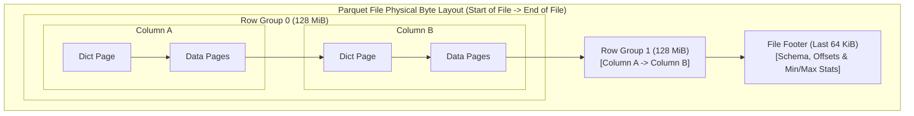
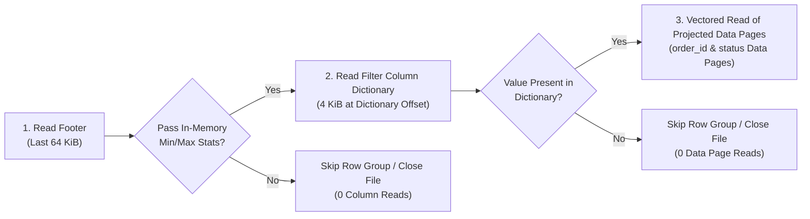
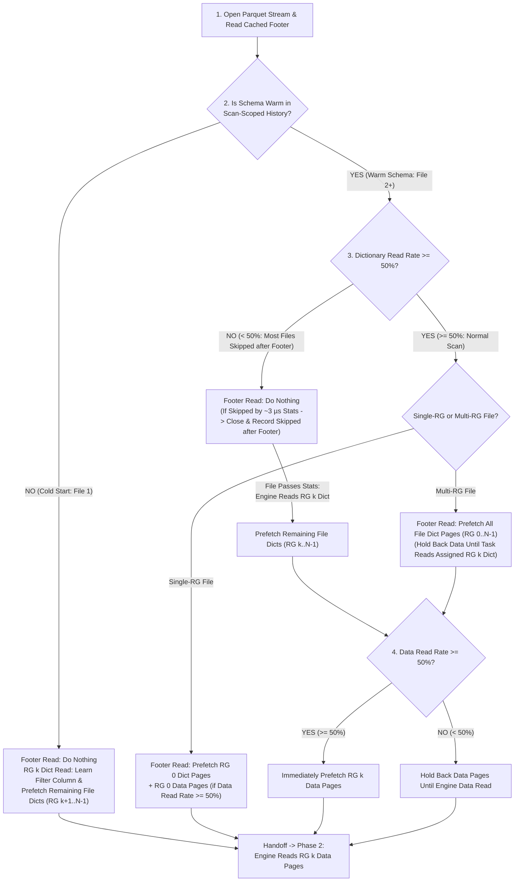
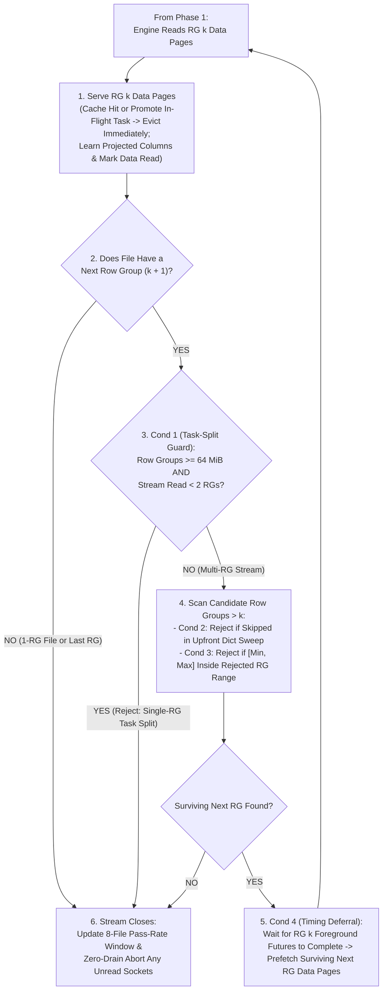
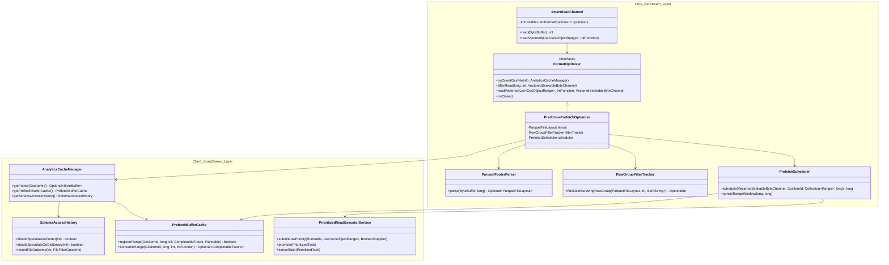
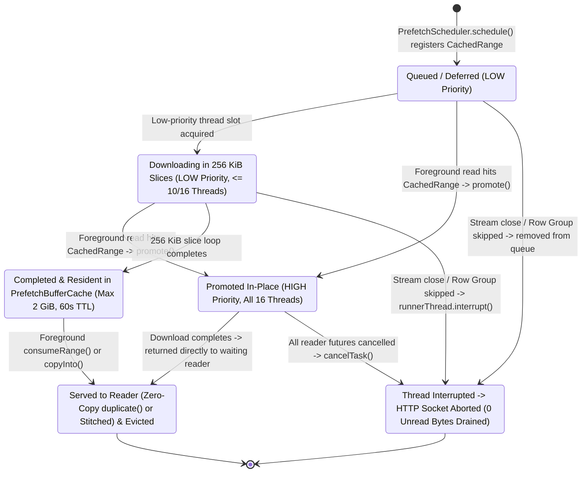

# Predictive Prefetching in GCS Analytics Core

**Self link:** [go/gcs-analytics-core-predictive-prefetch](http://goto.google.com/gcs-analytics-core-predictive-prefetch)  
**Visibility:** Confidential  
**Status:** Draft  
**Authors:** [Prudhvi Beerelly](mailto:pbeerelly@google.com)  
**Contributors:** N/A  
**Team:** Cloud Storage Analytics  
**Tracking Buganizer issue/hotlist:** N/A  
**Last major revision:** 2026-09-23

---

# Context

## Objective

Reduce Google Cloud Storage (GCS) network wait times during Apache Parquet scans in analytical query engines (such as Apache Spark, Apache Iceberg, and Trino) by predicting and prefetching the exact column byte ranges a query needs while the CPU decodes earlier data. Achieve an `XX%` reduction in table scan time without downloading unprojected columns or wasting network bandwidth on files and row groups skipped by query filters.

## Background

Analytical tables on GCS are stored as Apache Parquet files partitioned horizontally into **Row Groups** (typically `128 MiB` each) and vertically into **Column Chunks** (each starting with a small **Dictionary Page** followed by compressed **Data Pages**). At the end of the file, the **File Footer** stores the schema, column byte offsets, and `[min, max]` value statistics for every row group.



When executing a filtered query such as `SELECT order_id FROM orders WHERE status = 'PENDING'`, the query engine evaluates a three-stage filter funnel before reading multi-MiB data pages:



Without prefetching, the query engine stalls on GCS network round-trips (`5–25 ms` first-byte latency) between every row group and file. However, traditional sequential read-ahead fails on Parquet workloads for three reasons:
1. **Columnar Sparsity**: Selecting 2 columns (`40 MiB`) out of a `128 MiB` row group leaves `88 MiB` of unprojected columns (`amount`) in between; fixed-window read-ahead downloads those unused bytes.
2. **Non-Sequential Seeks**: The reader seeks backward from the footer at the end of the file to small `4 KiB` dictionary pages before issuing coalesced vectored reads for projected data pages.
3. **High Filter Rejection**: Query engines frequently skip row groups or close files immediately after checking the footer or a `4 KiB` dictionary page; eagerly prefetching multi-MiB data pages wastes network bandwidth and memory.

## Goals and Non-Goals

### Goals
* **Zero Unprojected Read Amplification**: Prefetch only the exact column byte ranges required by the active query.
* **Query-Agnostic Column Learning**: Infer **Dictionary Columns** (columns whose dictionary pages are read) and **Data Columns** (columns whose data pages are read) directly from byte-range read requests on the first file, reusing that knowledge across subsequent files of the same schema.
* **Filter-Aware Speculation**: Adapt dynamically to file and row-group filter pass rates so selective scans never download data pages for rejected files or pruned row groups.
* **Foreground Priority Isolation**: Guarantee that background prefetching never starves urgent foreground reads or delays stream and filesystem close operations.

### Non-Goals
* **Cross-Query State Sharing**: Learned column history and cached buffers are scoped strictly to a single table scan instance on an executor; sharing state across unrelated queries or across separate scans in a self-join is a non-goal.
* **Non-Parquet Formats**: Layout-aware prefetching targets Apache Parquet; other formats (CSV, JSON, ORC, Avro) use standard read paths.
* **Parquet Modular Encryption with Encrypted Footers**: Standard GCS encryption (GMEK, CMEK, CSEK) and Parquet Modular Encryption with plaintext footers (`PAR1` mode) are fully supported. Only Parquet files with client-side encrypted footers (`PARE` magic bytes) cannot have their column offsets parsed at the storage layer and gracefully fall back to standard reads.

---

# Design

## High-Level Design

*Note: This section presents the conceptual architecture, base prefetching behavior, and runtime guardrails in progressive order. Concrete Java class names, method contracts, and configuration properties are covered in the Low-Level Design.*

### Core Idea — Bridging Raw Byte Reads and Columnar Layouts

A storage input stream never sees the SQL query (`SELECT order_id, status FROM orders WHERE status = 'PENDING'`)—it only receives raw byte-range requests (`read(offset, length)`). Predictive prefetching bridges this gap using three properties of analytical Parquet scans:

1. **Every File Begins with a Self-Describing Footer**: Before reading any columns, the query engine always reads the last bytes of the Parquet file (the footer), which contains the table's schema and the exact start and end byte offsets for every column's dictionary and data pages.
2. **Byte Offsets Change Per File, But Column Names Stay Constant Across the Scan**: Column `status` might sit at `10 MiB` in `orders_001.parquet` and `18 MiB` in `orders_002.parquet`, so raw byte offsets cannot be reused across files. However, every file in the table scan executes the exact same SQL query and therefore reads the **exact same column names** (`Dictionary Columns = [status]` and `Data Columns = [order_id, status]`).
3. **Translate Byte Reads $\to$ Column Names on File 1, Then Column Names $\to$ Byte Offsets on File 2+**: By intersecting `File 1`'s foreground byte reads with `File 1`'s footer map, the stream learns the query's required **column names**. When `File 2`'s footer is read, the stream looks up those learned column names in `File 2`'s footer map to find their exact byte offsets in `File 2`—and downloads them in the background while the CPU is busy parsing footers or decoding earlier data.

---

### 1. How the Storage Stream Learns Columns Without SQL Hints (Cold Start $\to$ Warm Schema)

The storage stream never sees the SQL query—it only sees raw byte reads like `read(offset = 10 MiB, length = 100 KiB)`. It learns which columns the query needs in **3 steps**:

1. **Build a Byte-to-Column Map & Schema ID from the Footer**: Every Parquet footer lists the table's column names/types and the start/end byte of every column's **Dictionary** and **Data** inside that file. When a stream reads the footer, it hashes the `"<columnName>:<type>;"` list into a 32-bit **Schema ID** (`#A1B2`) and saves the file's byte-to-column lookup map in memory.
2. **Match Incoming Reads to the Map**: Whenever the query engine reads a byte range, the stream checks which column owns those bytes in the map:
   * Read lands in a column's **Dictionary bytes** $\to$ tag that column as a **Dictionary Column** (used for `WHERE` filtering).
   * Read lands in a column's **Data bytes** $\to$ tag that column as a **Data Column** (returned by `SELECT`).
3. **Save Column Names (Not Byte Offsets) in `Schema History`**: Because `status` might sit at `10 MiB` in File 1 and `18 MiB` in File 2, the stream saves the **column names** in shared `Schema History` under Schema ID `#A1B2`. Schema `#A1B2` is now **Warm** for all subsequent files.

> **Small Example (`SELECT order_id, status FROM orders WHERE status = 'PENDING'`)**:  
> 1. **Footer Read (`orders_001.parquet`)**: Builds File 1's map under Schema `#A1B2`: `order_id` Data (`0–10 MiB`), `status` Dict (`10.0–10.1 MiB`), `status` Data (`10.1–15 MiB`), `amount` Data (`15–40 MiB`).  
> 2. **Engine Reads `10.0–10.1 MiB`**: Matches `status` Dict $\to$ records `Dictionary Columns = [status]`.  
> 3. **Engine Reads `0–10 MiB` & `10.1–15 MiB`**: Matches `order_id` and `status` Data (skips `amount`) $\to$ records `Data Columns = [order_id, status]`.

---

### 2. The Base Design — Single-Row-Group vs. Multi-Row-Group Files

Once Schema Fingerprint `#A1B2` is **Warm** in `Schema History`, when the next file (`orders_002.parquet`) reads its footer, the Per-Stream Optimizer looks up `#A1B2`'s learned `Dictionary Columns` (`[status]`) and `Data Columns` (`[order_id, status]`) inside `orders_002.parquet`'s own parsed footer layout to resolve their exact byte offsets in `orders_002.parquet`. How the optimizer schedules background prefetches for those byte offsets depends on whether the file contains a **Single Row Group** or **Multiple Row Groups**:

| File Layout | 1. Cold Start (First Stream) | 2. Warm Schema — On Footer Read | 3. Warm Schema — On `Row Group k` Dictionary Read | 4. Warm Schema — On `Row Group k` Data Read |
| :--- | :--- | :--- | :--- | :--- |
| **Single-Row-Group File (`1 Row Group`)** | **Prefetches nothing** on footer or dictionary reads; updates `Dictionary Columns` on dictionary reads and `Data Columns` on data reads. | **Immediately prefetches `Row Group 0` dictionary pages AND `Row Group 0` data pages** while the CPU parses the footer. | **100% Cache Hit** (dictionary pages were already prefetched on Footer Read). | **100% Cache Hit** (data pages were already prefetched on Footer Read). |
| **Multi-Row-Group File (`Row Groups 0 .. N-1`)** | **Footer Read**: Prefetches nothing.<br/>**`RG k` Dict Read**: Updates `Dictionary Columns` & **immediately prefetches remaining dictionary pages (`RG k+1 .. N-1`)**.<br/>**`RG k` Data Read**: Updates `Data Columns` & prefetches **`RG k + 1` data pages**. | **Prefetches only the dictionary pages (`RG 0 .. N-1`)** across the file; **holds back data pages** until the task reveals which row group `k` it owns. | **100% Cache Hit** on `RG k` dictionary + **immediately prefetches `RG k` data pages** while the CPU evaluates the dictionary filter. | **100% Cache Hit** on `RG k` data + **prefetches `RG k + 1` data pages** once `RG k` finishes (when the stream scans multiple row groups). |

#### Why Single-Row-Group and Multi-Row-Group Files Behave Differently

* **How Single-Row-Group Files Work**:
  * In a single-row-group file (`<= 128 MiB`), a single task owns the entire file.
  * As soon as a warm stream reads the footer, the optimizer immediately launches background downloads for both the **dictionary pages** and the **data pages** of `Row Group 0`, overlapping network I/O with CPU footer parsing and reader initialization.
* **How Multi-Row-Group Files Work (With Concrete 4-Task Split Example)**:
  * Suppose `orders_large.parquet` (`512 MiB`) contains four `128 MiB` row groups (`RG 0` at `0–128 MiB`, `RG 1` at `128–256 MiB`, `RG 2` at `256–384 MiB`, and `RG 3` at `384–512 MiB`). Distributed engines (Spark, Iceberg, Trino) typically split this file along `128 MiB` boundaries and assign each row group to a separate task (`Task 0` through `Task 3`) across different executors.
  * **Why Footer Read Cannot Prefetch `RG 0` Data Pages**: When `Task 2` (assigned only `RG 2` at `256–384 MiB`) opens the file and reads the footer, prefetching `RG 0` data pages would download `Task 0`'s data into `Task 2`'s cache and discard it when `Task 2` closes. Therefore, on split-sized multi-row-group files, Footer Read prefetches **only the small dictionary pages** across all row groups and holds back data pages.
  * **How `Task 2` Triggers Its Own `RG 2` Data Pages**: Next, `Task 2` seeks to `256 MiB` and reads `RG 2`'s dictionary page. That read acts as a targeted beacon telling the optimizer *"This stream owns `RG 2`"*, immediately launching the background download for **`RG 2`'s data pages** while the CPU checks the dictionary.
  * **How Multi-Row-Group Streams Pipeline `RG k -> RG k + 1`**: When a single stream scans multiple row groups sequentially, finishing the foreground read of `RG k`'s data pages triggers a background prefetch of **`RG k + 1`'s data pages**, overlapping `RG k + 1`'s network download with the CPU decoding of `RG k`.

```mermaid
sequenceDiagram
    participant Engine as Query Engine
    participant Stream as Per-Stream Optimizer
    participant Shared as Shared Schema History & Buffer Cache
    participant GCS as GCS Network (Priority Pool)

    rect rgb(240, 248, 255)
    Note over Engine,GCS: File 1 (Cold Start, Multi-RG): Learn Dictionary & Data Columns, Overlap RG 1 with RG 0 Decode
    Engine->>Stream: 1. Read Footer -> Parse layout (Schema #A1B2 is Cold)
    Engine->>Stream: 2. Read 'status' Dictionary Page in RG 0
    Stream->>Shared: Add to Dictionary Columns = [status]; prefetch RG 1..N-1 'status' Dictionary Pages
    Engine->>Stream: 3. Read {order_id, status} Data Pages in RG 0
    Stream->>Shared: Add to Data Columns = [order_id, status]; mark File 1 Data Read
    Stream->>GCS: Background prefetch RG 1 {order_id, status} Data Pages (overlaps CPU decode of RG 0)
    Engine->>Stream: 4. Read RG 1 Data Pages -> 100% Buffer Cache Hit!
    end

    rect rgb(235, 255, 235)
    Note over Engine,GCS: File 2 (Warm Schema): Overlap Prefetch with CPU Footer & Dictionary Setup
    Engine->>Stream: 5. Open File 2 & Read Footer (Schema #A1B2 is Warm)
    Stream->>GCS: Immediately prefetch File 2 Dictionary Pages (+ RG 0 Data Pages on 1-RG file)
    Engine->>Stream: 6. Read File 2 Dictionary & Data Pages -> 100% Buffer Cache Hit!
    end
```

---

### 3. Guardrail 1 — Selective Queries & Read-Rate Gating (Cross-File Pruning)

#### Which Queries Need This & Why the Base Design Alone Fails

On **highly selective filter queries** (such as `WHERE order_date = '2026-09-23'` or `WHERE customer_id = 'CUST_999'`), a table scan may open thousands of files where **`90%+` of files contain zero matching rows**. Unconditionally prefetching on Footer Read breaks selective queries due to two race conditions:

1. **The Footer Min/Max Race (`~3 µs` In-Memory CPU Check vs. Background Download)**:
   * **What the Optimizer Knows on Footer Read**: Once the schema is warm after File 1, the optimizer immediately knows which columns the query needs as soon as File 2's footer is read.
   * **What the Query Engine Does Next (`~3 µs` CPU Check)**: Before reading any column bytes from File 2, the query engine parses the footer in memory and checks whether the filter value (`'2026-09-23'`) falls inside File 2's `[min, max]` statistics (`['2026-01-01', '2026-01-31']`). This CPU check takes `~3 µs` and requires **zero** column reads.
   * **Why Eager Prefetching Loses the Race**: When `90%` of files fail the `[min, max]` check, the engine closes `900` out of `1,000` streams just `3 µs` after reading each footer.
   * **Network & Shuffle Impact**: Launching background prefetches on Footer Read across those `900` skipped files fires hundreds of wasted HTTP GET requests microseconds before each stream closes—saturating network bandwidth and starving downstream shuffle stages.
2. **The Dictionary Filter Race (Dictionary Read vs. Data Page Download)**:
   * **When Footer Stats Cannot Reject the File**: A column with wide `[min, max]` bounds (such as `WHERE customer_id = 'CUST_999'` inside an alphabetical range `['CUST_000', 'CUST_ZZZ']`) passes the footer `[min, max]` check even when `'CUST_999'` is absent from the file.
   * **What the Query Engine Does Next**: The engine next reads only the small **dictionary page** at the start of the column chunk to check if `'CUST_999'` is present. If absent, the engine skips the row group or closes the file with **zero** data page reads.
   * **Why Data Prefetching Must Be Gated Separately**: If `95%` of files pass the wide `[min, max]` bounds but fail the dictionary check, prefetching the small dictionary page is inexpensive, whereas prefetching the multi-megabyte data pages wastes massive network bandwidth.

#### How the Two Read Rates Are Calculated (8-File Sliding Window)

To adapt automatically to any query's selectivity without knowing the SQL predicate, `Schema History` records how far the engine read in each of the **last 8 closed files** and computes two rates whose names directly state what they gate:

| File Outcome When Stream Closes | What the Engine Actually Read | Read-Rate Formulas (Over Last 8 Closed Files) |
| :--- | :--- | :--- |
| **`Skipped after Footer`** | Read **only the footer**, then closed (`0` dictionary reads, `0` data reads). | $$\text{Dictionary Read Rate} = \frac{\text{Skipped after Dictionary} + \text{Data Read}}{\text{Total Closed Files (up to 8)}}$$ <br/>*(How often a file reads at least the Dictionary)* |
| **`Skipped after Dictionary`** | Read **$\ge 1$ dictionary page**, then closed (`0` data reads). | $$\text{Data Read Rate} = \frac{\text{Data Read}}{\text{Skipped after Dictionary} + \text{Data Read}}$$ <br/>*(How often a dictionary-checked file goes on to read Data)* |
| **`Data Read`** | Read **$\ge 1$ data page** (file matched all filters). | Raises both **`Dictionary Read Rate`** and **`Data Read Rate`**. |

#### How Read Rates Modify the Base Design

Both gates default to open during warm-up ($< 2$ closed files) and stay open whenever their read rate is **$\ge 50\%$**:

| Read-Rate State | What Happens on Footer Read | What Happens on `Row Group k` Dictionary Read | Why This Works |
| :--- | :--- | :--- | :--- |
| **Normal Scan (`Dictionary Read Rate >= 50%` & `Data Read Rate >= 50%`)** | **Base Design Active**: Prefetches dictionary pages + `RG 0` data pages (1-RG file) or all dictionary pages (multi-RG file). | **Base Design Active**: Serves dictionary from cache; prefetches `RG k` data pages on multi-RG files. | Overlaps network downloads with CPU footer setup and dictionary evaluation when most files read data. |
| **Most Files Skipped after Footer (`Dictionary Read Rate < 50%`)** | **Pauses ALL Footer-Read Prefetching** (`0` dictionary and `0` data requests issued on Footer Read). | **Uses Dictionary Read as Proof File Passed Footer Stats**: If a file passes the `~3 µs` footer `[min, max]` check, the engine's foreground read of `RG k`'s dictionary page immediately triggers background prefetching of **remaining dictionary pages (`RG k .. N-1`) AND `RG k` data pages** (if `Data Read Rate >= 50%`). | Files skipped after the footer close in `~3 µs` with **zero** wasted HTTP requests, while matching files still overlap data-page downloads with CPU dictionary evaluation. |
| **Most Files Skipped after Dictionary (`Data Read Rate < 50%`)** | Prefetches **only dictionary pages** (if `Dictionary Read Rate >= 50%`); **never data pages**. | Prefetches **only remaining dictionary pages**; **holds back `RG k` data pages** until the engine actually reads a data page. | Prevents downloading data pages when almost all files are skipped after checking the dictionary. |

* **Self-Healing Sliding Window**: Because the rates only look at the last 8 closed files, if a selective scan moves from non-matching partitions into a cluster of matching partitions, 4 **`Data Read`** files in a row automatically raise both rates back to $\ge 50\%$ and re-enable Footer-Read prefetching.



---

### 4. Guardrail 2 — When `Row Group k + 1` Is Rejected or Deferred (Intra-File Pruning)

When a stream is reading data pages in `Row Group k` of a multi-row-group file, the Base Design normally prefetches `Row Group k + 1` so its download overlaps with `Row Group k`'s CPU decoding. However, the optimizer **rejects (skips) or defers `Row Group k + 1`** under four specific conditions:

| Condition | Why It Happens in Distributed Engines | How the Optimizer Rejects or Defers `Row Group k + 1` |
| :--- | :--- | :--- |
| **1. Single-Row-Group Task Split (`>= 64 MiB` Row Groups)** | On a `512 MiB` file with four `128 MiB` row groups, engines typically assign 1 row group per task (`Task 2` reads only `RG 2`, while `Task 3` reads `RG 3`). When `Task 2` finishes `RG 2`, it immediately closes its stream. Prefetching `RG 3` inside `Task 2` would download `Task 3`'s data right before `Task 2` closes. | When a file's row groups are split-sized (`>= 64 MiB`), the optimizer **rejects `RG k -> RG k + 1` speculation until the same stream has read data from at least 2 row groups** (which proves the stream is scanning multiple row groups rather than a single-row-group task split). For smaller row groups (`< 64 MiB`), `RG k + 1` is prefetched immediately after the first row group. |
| **2. Skipped During Upfront Dictionary Sweep** | Vectorized readers (such as Iceberg) often evaluate footer `[min, max]` stats across all row groups at file open and immediately sweep the dictionary pages of every surviving candidate row group before reading any data pages. | If the stream already read dictionary pages up to a higher row group `m > k` (for example, it read dictionaries in `Row Groups 0, 2, 3` while skipping `Row Group 1`), `Row Group 1` is known to have failed the filter. The optimizer **rejects `Row Group 1`** and jumps straight to prefetching **`Row Group 2`**. |
| **3. Rejected `[min, max]` Interval Containment** | Even without an upfront sweep across all row groups, whenever the engine skips the data pages of an earlier row group (for example, `Row Group 0` where filter column `price` has `[min, max] = [10, 50]`), no values inside `[10, 50]` satisfy the query predicate. | If a candidate row group's filter-column `[min, max]` interval falls completely inside any already-rejected row group's `[min, max]` interval (for example, `Row Group 1` has `price` `[20, 40]`, which lies inside `[10, 50]`), `Row Group 1` is guaranteed to fail the same filter and is **rejected**. |
| **4. Active Foreground Read In Progress (Timing Deferral)** | Submitting `Row Group k + 1` background requests at the exact microsecond `Row Group k` foreground requests are queued would allow background tasks to compete with `Row Group k`'s urgent network download. | Even when `Row Group k + 1` passes Conditions 1–3, scheduling is **deferred until `Row Group k`'s foreground read futures complete**, ensuring `Row Group k + 1` downloads strictly while the CPU is decoding `Row Group k`. |



---

### 5. Guardrail 3 — Protecting Foreground Threads, Memory & Network Sockets

Once speculative byte ranges pass the cross-file and intra-file gates above, four runtime protections ensure background prefetching never degrades foreground query latency, executor heap stability, or shuffle network throughput:

| Protection Mechanism | Runtime Behavior | Problem Prevented |
| :--- | :--- | :--- |
| **Reserved Foreground Thread Capacity** | Background prefetches run at `LOW` priority and are capped at `5/8` of the thread pool (`10 of 16` threads), reserving `6` threads exclusively for `HIGH`-priority foreground reads. | Prevents head-of-line thread pool starvation when dozens of tasks prefetch concurrently on an executor. |
| **In-Place Priority Promotion** | When a foreground read hits an in-flight (queued or actively downloading) background range in the cache, the existing task is promoted from `LOW` to `HIGH` priority in-place and awaited by the caller. | Eliminates duplicate GCS HTTP requests when the CPU catches up to an in-flight prefetch. |
| **Bounded Chunks & Immediate Eviction** | Adjacent projected columns are coalesced up to an `8 MiB` chunk ceiling, and cached buffers are evicted from the cache the instant a foreground read consumes them (using a zero-copy buffer slice on exact matches). | Prevents multi-megabyte heap spikes and garbage-collection stalls across concurrent executor tasks. |
| **Zero-Drain Socket Abort** | Background downloads pull HTTP streams in `256 KiB` slices; when a stream closes early or skips a row group, active worker threads are interrupted before closing the channel. | Forces an immediate socket abort (`0` unread bytes drained) instead of synchronously draining unread megabytes over the NIC during shuffle stages. |

---

## Low-Level Design

### 1. Module View & Class Architecture (`core` vs. `client`)

The implementation respects strict module boundaries: Parquet format parsing and stream speculation live in `core`, while reusable caching, cross-stream schema history, and priority thread pool execution live in `client`.



---

### 2. Component Contracts, Responsibilities & Invariants

| Component (`Class`) | Module & Scope | Core Responsibility & Offered Contract | Key Invariants & Bounds |
| :--- | :--- | :--- | :--- |
| **[`ParquetFooterParser`](file:///usr/local/google/home/pbeerelly/Downloads/gcs-analytics-core/core/src/main/java/com/google/cloud/gcs/analyticscore/core/prefetch/ParquetFooterParser.java)** & **[`ParquetFileLayout`](file:///usr/local/google/home/pbeerelly/Downloads/gcs-analytics-core/core/src/main/java/com/google/cloud/gcs/analyticscore/core/prefetch/ParquetFileLayout.java)** | `core` (Per Stream) | Validates `PAR1` magic bytes, parses Thrift `FileMetaData` from `AnalyticsCacheManager.getFooter(itemId)`, computes the 32-bit `schemaFingerprint` (`hashCode()` of `"<name>:<typeId>;"` across `FileMetaData.getSchema()`), and builds immutable `@AutoValue` interval maps for dictionary pages, data pages, and column `[min, max]` statistics. | Never performs network I/O (`readTail` is prohibited); returns `Optional.empty()` if footer cache is disabled or footer is encrypted (`PARE`). |
| **[`PredictivePrefetchOptimizer`](file:///usr/local/google/home/pbeerelly/Downloads/gcs-analytics-core/core/src/main/java/com/google/cloud/gcs/analyticscore/core/prefetch/PredictivePrefetchOptimizer.java)** | `core` (Per Stream) | Implements `FormatOptimizer` lifecycle hooks (`afterRead`, `readVectored`, `afterReadVectored`, `onClose`) to serve cached ranges, classify accessed offsets, and schedule or cancel speculative ranges. | Separates dictionary ranges (`[dictOffset, dataOffset)`) from data ranges (`[dataOffset, endOffset)`); coalesces adjacent columns up to `8 MiB`; defers Row Group `N + 1` prefetch until Row Group `N` foreground futures finish; for split-sized multi-row-group files (`SPLIT_BOUNDARY_ROW_GROUP_BYTES = 64 MiB`), gates `Row Group k -> k + 1` speculation on `filterTracker.getDataTouchedCount() >= 2`. |
| **[`RowGroupFilterTracker`](file:///usr/local/google/home/pbeerelly/Downloads/gcs-analytics-core/core/src/main/java/com/google/cloud/gcs/analyticscore/core/prefetch/RowGroupFilterTracker.java)** | `core` (Per Stream) | Tracks touched dictionary/data row-group ordinals and rejected column `[min, max]` intervals within an open stream to predict the next surviving row group. | Marks a row group pruned if skipped during an upfront dictionary sweep or if its filter column `[min, max]` interval is contained within a rejected row group's interval. |
| **[`PrefetchScheduler`](file:///usr/local/google/home/pbeerelly/Downloads/gcs-analytics-core/core/src/main/java/com/google/cloud/gcs/analyticscore/core/prefetch/PrefetchScheduler.java)** | `core` (Per Stream) | Submits low-priority vectored range requests to the channel, registers `CachedRange` entries in `PrefetchBufferCache`, and cancels unconsumed ranges when row groups are skipped or the stream closes. | Enforces `MAX_CONCURRENT_PREFETCH_RANGES = 32` in-flight ranges per stream. |
| **[`SchemaAccessHistory`](file:///usr/local/google/home/pbeerelly/Downloads/gcs-analytics-core/client/src/main/java/com/google/cloud/gcs/analyticscore/client/SchemaAccessHistory.java)** | `client` (Per Scan) | Maps 32-bit `schemaFingerprint` to learned `dictionaryColumns`, `dataColumns`, and two 8-file sliding outcome windows (`recentFooterOutcomes` and `recentDictOutcomes`). | Bounded at `1,024` schemas and `256` columns/schema ($< 1\text{ MiB}$ heap); recording a data read never removes a column from `dictionaryColumns`; gates open when $< 2$ outcomes exist or pass ratio $\ge 0.50$. |
| **[`PrefetchBufferCache`](file:///usr/local/google/home/pbeerelly/Downloads/gcs-analytics-core/client/src/main/java/com/google/cloud/gcs/analyticscore/client/PrefetchBufferCache.java)** & **[`CachedRange`](file:///usr/local/google/home/pbeerelly/Downloads/gcs-analytics-core/client/src/main/java/com/google/cloud/gcs/analyticscore/client/CachedRange.java)** | `client` (Per Scan) | Byte-weighted Caffeine cache keyed by `(GcsItemId, startOffset)` with a per-file `ConcurrentSkipListSet<Long>` floor-offset index for $O(\log N)$ range lookup and multi-chunk stitching. | Default `2 GiB` byte cap (`60s` idle TTL); `consumeRange` promotes in-flight ranges, immediately evicts consumed ranges (`endOffset <= readEnd`), and uses a **zero-copy `buf.duplicate()` fast path** on exact single-range matches. |
| **[`PrioritizedReadExecutorService`](file:///usr/local/google/home/pbeerelly/Downloads/gcs-analytics-core/client/src/main/java/com/google/cloud/gcs/analyticscore/client/PrioritizedReadExecutorService.java)** & **[`GcsReadChannel`](file:///usr/local/google/home/pbeerelly/Downloads/gcs-analytics-core/client/src/main/java/com/google/cloud/gcs/analyticscore/client/GcsReadChannel.java)** | `client` (Per Scan) | Unified 16-thread `PriorityBlockingQueue` executor and HTTP channel layer supporting priority promotion, `effectiveMaxMergeGap = 0` exact ranges, and `256 KiB` interruptible chunk reads. | Caps active `LOW` tasks at `10/16` threads; `cancelTask` interrupts worker threads before `readChannel.close()` to abort HTTP sockets with zero unread byte draining; `shutdown()` bounds `awaitTermination` to `10 ms`. |

---

### 3. Prefetched Range & Task Lifecycle State Machine

The state diagram below specifies how each prefetched range transitions through [`PrefetchBufferCache`](file:///usr/local/google/home/pbeerelly/Downloads/gcs-analytics-core/client/src/main/java/com/google/cloud/gcs/analyticscore/client/PrefetchBufferCache.java) and [`PrioritizedReadExecutorService`](file:///usr/local/google/home/pbeerelly/Downloads/gcs-analytics-core/client/src/main/java/com/google/cloud/gcs/analyticscore/client/PrioritizedReadExecutorService.java), ensuring zero duplicate requests, zero memory retention after consumption, and zero socket draining on cancellation:



---

## Alternatives Considered

| Dimension | Proposed: Layout- & Filter-Aware Predictive Prefetching (Scan-Scoped) | Alternative 1: Fixed-Block Sequential Read-Ahead (8 MiB Windows) | Alternative 2: Unconditional Eager Row-Group 0 Prefetch at Footer Read | Alternative 3: Global JVM Singleton for Schema History & Cache |
| :--- | :--- | :--- | :--- | :--- |
| **Read Amplification on Wide Tables** | ➕ **Zero unprojected bytes** (`effectiveMaxMergeGap = 0`; fetches exact projected column ranges). | ➖ **High** (downloads unprojected columns between projected columns). | ➕ **Low on surviving files**, **high on skipped files**. | ～ Same within a single scan, **polluted on self-joins**. |
| **Selective Filter Queries (High File Skipping)** | ➕ **Zero wasted requests** (8-file sliding window pauses footer-read prefetch when `Dictionary Read Rate < 50%`). | ➖ **High waste** (prefetches ahead of first read before stream closes). | ➖ **Severe waste** (launches multi-MiB HTTP requests for every file before `~3 µs` min/max stats skip the file). | ➖ **Cross-Scan Collision** (a self-join scanning the same table twice with different columns or filters overwrites the shared `Schema ID` state). |
| **Decision** | **SELECTED** | **REJECTED** (Violates zero read-amplification goal). | **REJECTED** (Wastes bandwidth and stalls shuffle stages on selective queries). | **REJECTED** (Collides when concurrent scans or self-joins read different columns/filters of the same table). |

---

# Quality Attributes & Operations

## Latency and Throughput Expectations

| Workload Pattern | Expected Impact |
| :--- | :--- |
| **Single-Row-Group Files (`16–128 MiB`)** | **`XX%` reduction in aggregate table scan time** by overlapping Row Group 0 column downloads with footer parsing and reader initialization. |
| **Multi-Row-Group Files (`512 MiB`, `128 MiB` Row Groups)** | **`XX%` reduction in aggregate table scan time** and **`XX%` reduction in end-to-end query duration** by overlapping Row Group `N + 1` downloads with Row Group `N` CPU decoding and supporting split-boundary task isolation. |
| **Highly Selective Scans (90%+ File/Row-Group Pruning)** | **Zero scan regression and `XX%` reduction in shuffle wait overhead** by gating footer-read and dictionary-read speculation via the 8-file sliding window and aborting cancelled HTTP sockets with zero unread byte draining. |

## Configuration, Telemetry, and Rollback

### Configuration Properties ([`GcsPrefetchOptions`](file:///usr/local/google/home/pbeerelly/Downloads/gcs-analytics-core/client/src/main/java/com/google/cloud/gcs/analyticscore/client/GcsPrefetchOptions.java))

| Property Key | Default | Description |
| :--- | :---: | :--- |
| `analytics-core.prefetch.mode` | `DISABLED` | Set to `PREDICTIVE_ROW_GROUP` (or `predictive-row-group`) to enable predictive prefetching. |
| `analytics-core.footer.cache.enabled` | `false` | Must be `true` when `PREDICTIVE_ROW_GROUP` is enabled so `GcsFooterOptimizer` populates `AnalyticsCacheManager.getFooter(itemId)`. |
| `analytics-core.prefetch.buffer.cache.max-size-bytes` | `2147483648` (`2 GiB`) | Maximum total byte capacity of `PrefetchBufferCache` per `AnalyticsCacheManager`. |
| `analytics-core.prefetch.buffer.cache.ttl-seconds` | `60` | Idle expiration time (`expireAfterAccess`, in seconds) for unconsumed ranges in `PrefetchBufferCache`. |
| `analytics-core.prefetch.block.size-bytes` | `4194304` (`4 MiB`) | Nominal block size configuration preserved for compatibility. |
| `analytics-core.prefetch.history.max-columns` | `256` | Maximum number of dictionary and data columns tracked per `schemaFingerprint` in `SchemaAccessHistory`. |

### Telemetry Metrics ([`GcsAnalyticsCoreTelemetryConstants.Metric`](file:///usr/local/google/home/pbeerelly/Downloads/gcs-analytics-core/common/src/main/java/com/google/cloud/gcs/analyticscore/common/GcsAnalyticsCoreTelemetryConstants.java))

| Metric Constant | Metric Name | Type | Description |
| :--- | :--- | :---: | :--- |
| `PREFETCH_CACHE_HIT` | `gcs.analytics-core.client.prefetch.cache.hits` | `COUNTER` | Foreground `read` or `readVectored` calls served from `PrefetchBufferCache`. |
| `PREFETCH_CACHE_MISS` | `gcs.analytics-core.client.prefetch.cache.misses` | `COUNTER` | Foreground `read` calls that missed `PrefetchBufferCache`. |
| `PREFETCH_BYTES_LOADED` | `gcs.analytics-core.client.prefetch.bytes.loaded` | `COUNTER` | Total speculative bytes downloaded into `PrefetchBufferCache`. |
| `PREFETCH_BYTES_CONSUMED` | `gcs.analytics-core.client.prefetch.bytes.consumed` | `COUNTER` | Total prefetched bytes consumed by foreground `read` or `readVectored` calls. |

### Rollback Strategy
Predictive prefetching is **disabled by default** (`analytics-core.prefetch.mode=DISABLED`). When disabled, `PredictivePrefetchOptimizer.isApplicable` returns `false`, bypassing all prefetch code paths with zero runtime overhead. Any deployment can roll back immediately via configuration by setting `analytics-core.prefetch.mode=DISABLED` without redeploying binaries.

---

# Document history

| Date | Author | Change |
| :--- | :--- | :--- |
| 2026-09-23 | [Prudhvi Beerelly](mailto:pbeerelly@google.com) | Restructured HLD into a 3-stage conceptual pipeline with tables and single-sentence edge cases; reorganized LLD around a module-grouped class diagram, a component contracts/bounds table, and a range lifecycle state machine (`stateDiagram-v2`). |
