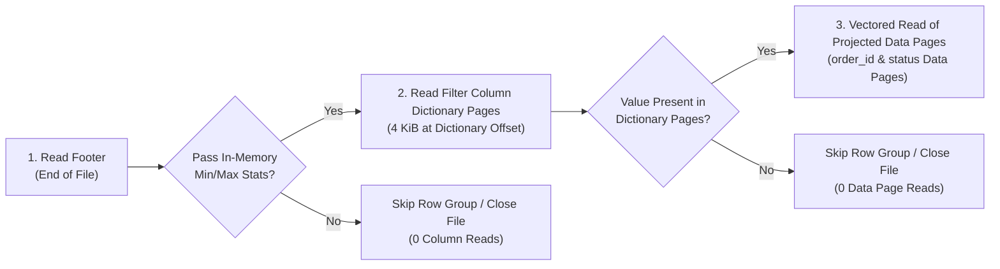
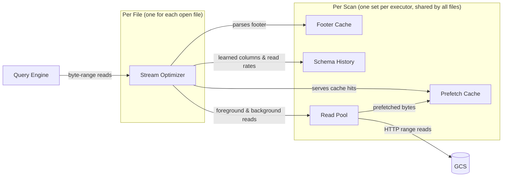
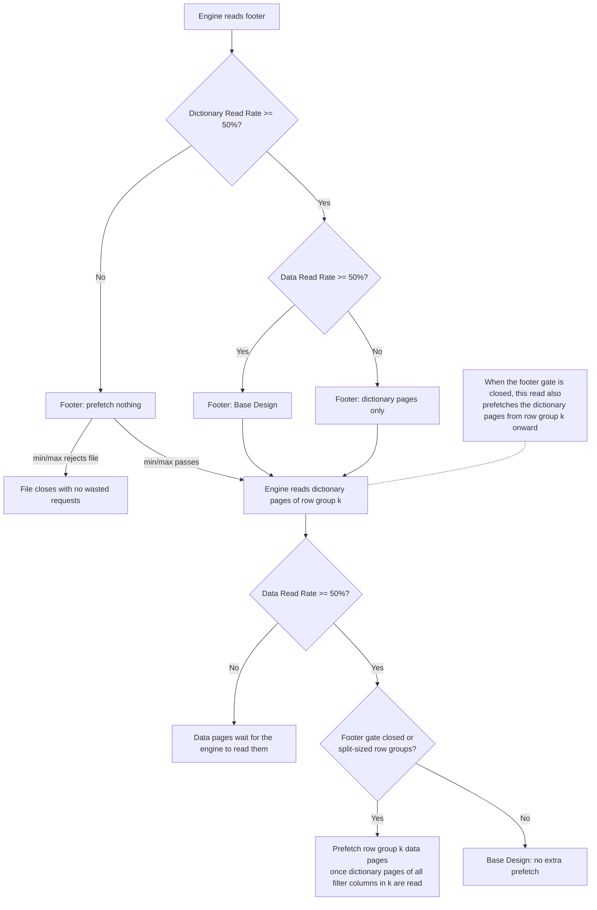
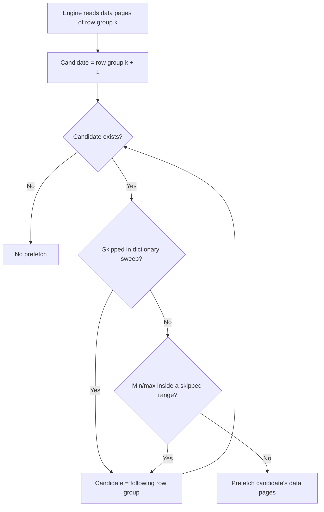
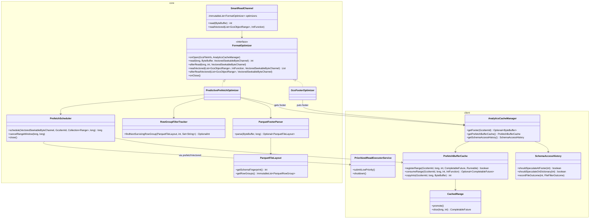
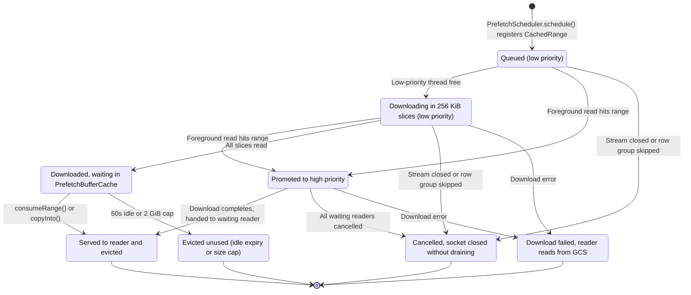

# Predictive Prefetching in GCS Analytics Core

**Self link:** [go/gcs-analytics-core-predictive-prefetch](http://goto.google.com/gcs-analytics-core-predictive-prefetch)  
**Visibility:** Confidential  
**Status:** Draft  
**Authors:** [Prudhvi Beerelly](mailto:pbeerelly@google.com)  
**Contributors:** N/A  
**Team:** Cloud Storage Analytics  
**Tracking Buganizer issue/hotlist:** N/A  
**Last major revision:** 2026-09-23

---

# Context

## Objective

Reduce Google Cloud Storage (GCS) network wait times during Apache Parquet scans in analytical query engines (such as Apache Spark, Apache Iceberg, and Trino) by predicting and prefetching the exact column byte ranges a query needs while the CPU decodes earlier data. Achieve an `XX%` reduction in table scan time without downloading unprojected columns or wasting network bandwidth on files and row groups skipped by query filters.

## Background

Analytical tables on GCS are stored as Apache Parquet files partitioned horizontally into **Row Groups** (typically `128 MiB` each) and vertically into **Column Chunks** (each starting with a small **Dictionary Page** followed by compressed **Data Pages**). At the end of the file, the **File Footer** stores the schema, column byte offsets, and `[min, max]` value statistics for every row group.


When executing a filtered query such as `SELECT order_id FROM orders WHERE status = 'PENDING'`, the query engine evaluates a three-stage filter funnel before reading multi-MiB data pages:



Without prefetching, the query engine stalls on GCS network round-trips (`5–25 ms` first-byte latency) between every row group and file. However, traditional sequential read-ahead fails on Parquet workloads for three reasons:
1. **Columnar Sparsity**: Selecting 2 columns (`40 MiB`) out of a `128 MiB` row group leaves `88 MiB` of unprojected columns (`amount`) in between; fixed-window read-ahead downloads those unused bytes.
2. **Non-Sequential Seeks**: The reader seeks backward from the footer at the end of the file to small `4 KiB` dictionary pages before issuing coalesced vectored reads for projected data pages.
3. **High Filter Rejection**: Query engines frequently skip row groups or close files immediately after checking the footer or a `4 KiB` dictionary page; eagerly prefetching multi-MiB data pages wastes network bandwidth and memory.

### How Engines Split Files Across Tasks

A table scan is divided into **task splits**: byte ranges of files, each read by one task. Apache Iceberg aims for `128 MiB` per split by default (`read.split.target-size`) and cuts Parquet files only at row group boundaries. Depending on file and row group sizes, this gives three cases:

| Case | Example (`128 MiB` splits) | Who Reads the File |
| :--- | :--- | :--- |
| **One file, one task** | A `100 MiB` file with one row group. | One task reads the whole file. |
| **One file, many tasks** | A `512 MiB` file with four `128 MiB` row groups. | Four tasks, each reading one row group, often on different executors. |
| **Many files, one task** | Ten `10 MiB` files. | Iceberg packs them into one split, so one task reads all ten files one after another. |

A task reads only the row groups that start inside its split. So what decides which row groups a task reads is how big the row groups are compared to a split:

* **Small row groups**: The file has one row group, or several row groups much smaller than a split. One task reads several row groups in a row.
* **Split-sized row groups**: Each row group is about as big as a split, so each row group goes to a different task.

## Goals and Non-Goals

### Goals
* **Minimal Read Amplification**: Prefetch only the column byte ranges the active query reads, adding at most `XX%` extra GCS egress over the same scan without prefetching.
* **Query-Agnostic Column Learning**: Learn which columns a query reads directly from its byte-range reads on the first file, and reuse that knowledge for later files with the same schema.
* **Filter-Aware Speculation**: Adapt dynamically to file and row-group filter pass rates so selective scans never download data pages for rejected files or pruned row groups.
* **Foreground Priority Isolation**: Guarantee that background prefetching never starves urgent foreground reads or delays stream and filesystem close operations.

### Non-Goals
* **Cross-Query State Sharing**: Learned column history and cached buffers live only as long as the storage filesystem instance (one per table scan per executor in Iceberg). Sharing state across unrelated queries or across separate scans in a self-join is a non-goal.
* **Non-Parquet Formats**: Layout-aware prefetching targets Apache Parquet; other formats (CSV, JSON, ORC, Avro) use standard read paths.
* **Parquet Modular Encryption with Encrypted Footers**: Standard GCS encryption (GMEK, CMEK, CSEK) and Parquet Modular Encryption with plaintext footers (`PAR1` mode) are fully supported. Only Parquet files with client-side encrypted footers (`PARE` magic bytes) cannot have their column offsets parsed at the storage layer and gracefully fall back to standard reads. The same fallback applies when a footer is larger than the cached file tail.

---

# Design

## High-Level Design

### Components and Scope

Predictive prefetching runs inside the storage input stream, between the query engine and GCS. It has two kinds of parts: a **per-file** part, created when the engine opens a file and dropped when it closes it, and **per-scan** parts, created once on each executor for a table scan and shared by every file that scan opens.



| Component | Kind | Job |
| :--- | :--- | :--- |
| **Stream Optimizer** | Per file | Watches the engine's byte reads, decides what to prefetch next, and cancels unused prefetches when the file closes. |
| **Footer Cache** | Per scan | Holds the tail of each file, filled when the engine first reads the footer. The Stream Optimizer only parses this copy and never fetches a footer itself. |
| **Schema History** | Per scan | Remembers which columns the query reads and how often files are skipped, keyed by the table schema. |
| **Prefetch Cache** | Per scan | Holds prefetched bytes until a foreground read uses them. |
| **Read Pool** | Per scan | Runs all GCS downloads for the scan, both foreground and background. |

**Scope.** The shared parts live as long as the storage filesystem instance that opens the files. Apache Iceberg creates one such instance per table scan on each executor, which is what makes the shared state scan-scoped. Engines that share one filesystem instance across the whole JVM would share history across scans.

**Safety.** Prefetching never changes the bytes the engine receives. Every read is served either from prefetched bytes of the same range or from GCS. If a prefetch fails or is cancelled, the read falls back to GCS. A wrong prediction only costs time or bandwidth.

**When it turns off.** The Stream Optimizer needs the footer from the Footer Cache. If the footer cache is disabled, the footer is larger than the cached tail, or the footer is encrypted, the stream does not prefetch for that file.

---

### 1. Learning Columns: Cold to Warm

The stream never sees the SQL query. It only sees raw byte-range reads. Column byte positions change from file to file, but every file in the scan runs the same query and reads the same columns. So the stream learns column **names** on the first file, then looks up their **positions** in each later file's footer. It uses two things to do this:

* **Schema ID**: a hash of the column names and types listed in the footer. All files of the same table get the same ID.
* **Schema History**: a map, shared by all files of the scan, that stores two lists for each Schema ID: the filter (dictionary) columns and the data columns read so far in the scan.

| Step | What the Stream Does |
| :--- | :--- |
| **1. Read the footer** | Builds a map from byte ranges to columns, and computes the Schema ID. |
| **2. Classify each engine read** | A read inside a column's dictionary pages marks it as a **Dictionary Column** (used by the `WHERE` filter). A read inside its data pages marks it as a **Data Column** (returned by the query). |
| **3. Save column names** | Adds the names, not the byte positions, to the Schema ID's entry in Schema History. Columns are only added, never removed. |

Once the entry holds columns, the schema is **Warm**, and every later file with the same Schema ID becomes a candidate for prefetching.

> **Example** (`SELECT order_id, status FROM orders WHERE status = 'PENDING'`)
> 1. File 1's footer is read. The stream builds its byte-to-column map. Nothing is known yet (**Cold**).
> 2. The engine reads the dictionary of `status`. Dictionary Columns = `[status]`.
> 3. The engine reads the data pages of `order_id` and `status`, and skips `amount`. Data Columns = `[order_id, status]`. The schema is now **Warm**.

---

### 2. Base Design: Prefetching Only the Row Groups a Task Reads

What the stream can safely prefetch depends on whether the file has small or split-sized row groups (defined in Background).

**Cold (first file).** The stream is still learning columns, so it prefetches very little:

| Engine Read | Small Row Groups | Split-Sized Row Groups |
| :--- | :--- | :--- |
| **Footer Read** | Nothing, since no columns are learned yet. | Nothing, since no columns are learned yet. |
| **Dictionary Pages Read** *(only with `WHERE`)* | Learns the filter columns and prefetches the dictionary pages of later row groups. | Learns the filter columns and prefetches the dictionary pages of later row groups. |
| **Data Pages Read** | Learns the data columns and prefetches the next row group's data pages, using the columns learned so far. | Learns the data columns. Prefetches the next row group's data pages only after the stream has read data pages from two row groups. |

**Warm (later files).** The stream knows the columns, so it can prefetch before the engine asks:

| Engine Read | Small Row Groups | Split-Sized Row Groups |
| :--- | :--- | :--- |
| **Footer Read** | With `WHERE`: prefetches the dictionary pages of all row groups, plus the data pages if the file has one row group. Without `WHERE`: prefetches the data pages of the first row group. | With `WHERE`: prefetches the dictionary pages of all row groups. Without `WHERE`: nothing. |
| **Dictionary Pages Read** *(only with `WHERE`)* | Served from the cache. No data page prefetch. | Served from the cache. Once the dictionary pages of all filter columns in row group `k` are read, prefetches the data pages of row group `k`. This happens once per stream. |
| **Data Pages Read** | Served from the cache when prefetched. Prefetches the next row group's data pages, so that download overlaps with decoding row group `k`. | Served from the cache. Prefetches the next row group's data pages only after the stream has read data pages from two row groups. |

**Why split-sized row groups are handled differently.** Every task reads the footer first, even the task that owns only the last row group. Prefetching data pages on the footer read would download another task's bytes. Prefetching the next row group after a task's own row group would do the same, because the task closes right after. So the stream waits for signals that show which row groups this task owns: reading the dictionary pages of row group `k` shows the task owns `k`, and reading data pages from two row groups shows the task covers more than one.

**Why the trigger waits for all filter columns.** Readers sometimes read the dictionary pages of the *next* row group right after their own. Waiting until the dictionary pages of every filter column in row group `k` are read, and firing only once per stream, stops a peek at the next row group from starting a large data page download.

> **Known gaps**
> * A query with no `WHERE` condition on split-sized row groups never reads dictionary pages, so nothing shows which row group the task owns, and each task's own row group is never prefetched.
> * On a file with small row groups that is split across several tasks, a task that starts partway through the file still prefetches the first row group's data pages on the footer read when the query has no `WHERE` condition. Example: Task 2 starts at row group 8 but prefetches row group 0, which belongs to Task 0.
> * On a file with several small row groups and a `WHERE` condition, neither the footer nor the dictionary pages trigger a data page prefetch, so the first row group each task reads is always a cache miss.

```mermaid
sequenceDiagram
    participant Engine as Query Engine (Task 2)
    participant Opt as Stream Optimizer
    participant Cache as Prefetch Cache
    participant GCS as GCS

    Engine->>Opt: Read footer (schema is Warm)
    Opt->>GCS: Prefetch dictionary pages of all row groups
    Engine->>Cache: Read row group 2 dictionary pages (cache hit)
    Opt->>GCS: Prefetch row group 2 data pages
    Note over Engine: Checks dictionary pages while data pages download
    Engine->>Cache: Read row group 2 data pages (cache hit)
    Engine->>Opt: Close stream
    Opt->>Cache: Drop unused dictionary pages
```

---

### 3. Guardrail 1: Selective Queries and Read-Rate Gates

#### What Breaks

The Background section shows the two points where the engine drops a file: after the min/max check on the footer, and after checking the dictionary pages. On highly selective queries, such as `WHERE order_date = '2026-09-23'` on date-partitioned data or `WHERE customer_id = 'CUST_999'` on wide min/max ranges, most files stop at one of these points. The Base Design then wastes work in two ways:

1. Files skipped after the footer close a few microseconds after the footer read, so every prefetch started on the footer read is a wasted HTTP request.
2. Files skipped after checking the dictionary pages never read data pages, so prefetching their data pages wastes the largest downloads.

#### How the Stream Measures It

For each file, Schema History records how far the engine got, separately for each Schema ID:

| File Outcome | What the Engine Read |
| :--- | :--- |
| **Skipped after Footer** | Only the footer. |
| **Skipped after Dictionary** | At least one dictionary page, but no data pages. |
| **Data Read** | At least one data page. |

From these, it computes two rates:

$$\text{Dictionary Read Rate} = \frac{\text{Skipped after Dictionary} + \text{Data Read}}{\text{last 8 files}}$$

$$\text{Data Read Rate} = \frac{\text{Data Read}}{\text{last 8 files that read a dictionary or data page}}$$

Each gate stays open while its rate is at least 50%, or while fewer than 2 files have been recorded. Both numbers are fixed constants, not tuned per workload. A window of 8 files lets a gate react within a few files while one unusual file cannot flip it. The 50% line means prefetching stops once more files are skipped than read.

#### How the Gates Change the Base Design

| | **Data Read Rate ≥ 50%** | **Data Read Rate < 50%** |
| :--- | :--- | :--- |
| **Dictionary Read Rate ≥ 50%** | **Footer**: Base Design.<br/>**Dictionary pages**: Base Design. | **Footer**: dictionary pages only, never data pages.<br/>**Dictionary pages**: no data page prefetch. Data pages wait until the engine reads them. |
| **Dictionary Read Rate < 50%** | **Footer**: nothing.<br/>**Dictionary pages of row group `k`**: the read proves the file passed min/max, so the stream prefetches the dictionary pages from row group `k` onward and, once the dictionary pages of all filter columns in row group `k` are read, the data pages of row group `k`. This applies to both file types. | **Footer**: nothing.<br/>**Dictionary pages**: prefetches the dictionary pages of remaining row groups only. Data pages wait until the engine reads them. |

The rates only look at the last 8 files, so they recover by themselves. Example: if a scan moves from non-matching partitions into matching ones, 4 Data Read files in a row bring the Dictionary Read Rate back to 50% and turn footer-read prefetching back on.



---

### 4. Guardrail 2: Skipping Rejected Row Groups Inside a File

#### What Breaks

Once a stream reads data pages from several row groups, the Base Design prefetches the next row group after each one. On selective queries over files with many row groups, especially when the data is sorted or clustered by the filter column, the engine skips many of those row groups because their min/max or dictionary pages fail the filter. Prefetching a skipped row group wastes a full row group of downloads.

#### How the Stream Picks the Next Row Group

After a data page read in row group `k`, the stream walks forward from `k + 1` and picks the first row group that no signal rules out:

| Signal | What the Engine Does | How the Stream Uses It |
| :--- | :--- | :--- |
| **Skipped in the dictionary sweep** | Some readers (such as Iceberg) check min/max for all row groups when the file opens, then read the dictionary pages of every row group that passed, before reading any data pages. | If the stream has seen dictionary page reads for row groups 0, 2, and 3 but not 1, then row group 1 failed the filter. The stream skips it and prefetches row group 2. |
| **Min/max inside a rejected range** | The engine skipped an earlier row group, for example one where `price` ranges from 10 to 50. | If a later row group's `price` range (for example, 20 to 40) sits entirely inside the skipped range, the stream predicts it will be skipped too. |

Both signals are predictions. The min/max signal is wrong in two cases:

* The earlier row group was skipped by its **dictionary pages**, not its min/max. Example: `price = 30` is inside `[10, 50]` but missing from that row group's dictionary pages, while the later `[20, 40]` row group does contain 30.
* The filter uses **several columns** (`a = 1 AND b = 2`). The earlier row group may have been skipped because of `b`, which says nothing about `a`.

> **Known gap**: The stream treats every earlier row group it never read as skipped, including row groups that belong to other tasks' splits. A task whose split starts at row group 5 records row groups 0 to 4 as skipped even though it never checked them, which can wrongly rule out later row groups.



---

### 5. Runtime Protections

The guardrails above decide *what* to prefetch. These protections control *how* prefetches run, so background work never slows the query. They matter most when many tasks prefetch at once on the same executor (large multi-row-group files) and during shuffle-heavy queries, where network bandwidth and memory are already tight.

| Protection | What It Does | Problem It Prevents |
| :--- | :--- | :--- |
| **Wait for the foreground read** | The prefetch of the next row group starts only after the current row group's foreground download finishes. Applies to vectored reads. | Background downloads competing with the current row group's urgent download. |
| **Reserved foreground threads** | Background downloads run at low priority and may use only part of the Read Pool. The rest is kept for foreground reads. | Many tasks' prefetches filling the pool and blocking foreground reads. |
| **In-place promotion** | If a foreground read needs bytes that are still queued or downloading in the background, that download is raised to foreground priority and the reader waits for it. | Downloading the same bytes twice. |
| **Bounded chunks and instant eviction** | Neighboring columns are merged into chunks of a capped size. Bytes are dropped from the Prefetch Cache as soon as the engine reads them. | Large heap spikes and garbage-collection pauses. |
| **Bounded cache and in-flight limit** | The Prefetch Cache has a total size cap and drops entries that sit unused for too long. Each stream also caps how many prefetches it can have in flight. | Unused prefetches piling up in memory, or one stream flooding the Read Pool. |
| **Abort instead of drain** | Background downloads read in small slices. When a file closes or a row group is skipped, the download thread is interrupted and the connection is closed without reading the rest. | Draining unread megabytes over the network while shuffle stages need the bandwidth. |

---

## Low-Level Design

### 1. Module View

Parquet parsing and prefetch decisions live in `core`. The shared cache, schema history, and prioritized read pool live in `client`. `PredictivePrefetchOptimizer` depends on `GcsFooterOptimizer` having cached the footer; it never reads the footer from GCS itself.



### 2. From HLD Events to Code Hooks

`SmartReadChannel` calls each `FormatOptimizer` hook in order. `PredictivePrefetchOptimizer` maps the HLD events onto them as follows:

| Hook | HLD Event | What `PredictivePrefetchOptimizer` Does |
| :--- | :--- | :--- |
| `onOpen` | Stream opens | Binds the shared cache and history, creates a fresh `PrefetchScheduler` and `RowGroupFilterTracker`. |
| `read` / `afterRead` | Footer, dictionary, or data read (single buffer) | Serves from `PrefetchBufferCache.copyInto`, loads the layout on first use, then calls `observeAccess`: footer reads go to `prefetchFirstRowGroupOnce`, dictionary page reads go to the dictionary trigger, data page reads go to `speculateRowGroups`. |
| `readVectored` | Data read (vectored) | Serves each range from `PrefetchBufferCache.consumeRange`, then `recordVectoredAccess` records columns and picks the next surviving row group. |
| `afterReadVectored` | After the foreground vectored read is submitted | Footer case goes to `prefetchFirstRowGroupOnce`. Otherwise waits on the foreground range futures, then calls `speculateRowGroup` for the next row group. |
| `onClose` | Stream closes | Records the file outcome in `SchemaAccessHistory` (if not already recorded) and cancels all unconsumed prefetches. |

When the engine moves to a later row group without reading data from the current one, `observeAccess` calls `PrefetchScheduler.cancelRangeWindow` on the current row group.

### 3. Component Contracts

| Class | Module, Scope | Responsibility | Bounds |
| :--- | :--- | :--- | :--- |
| [`ParquetFooterParser`](file:///usr/local/google/home/pbeerelly/Downloads/gcs-analytics-core/core/src/main/java/com/google/cloud/gcs/analyticscore/core/prefetch/ParquetFooterParser.java), [`ParquetFileLayout`](file:///usr/local/google/home/pbeerelly/Downloads/gcs-analytics-core/core/src/main/java/com/google/cloud/gcs/analyticscore/core/prefetch/ParquetFileLayout.java) | `core`, per stream | Parses the cached footer into an immutable layout: schema fingerprint, row groups, column byte ranges, and min/max statistics. | No network I/O. Returns empty when the footer is missing, longer than the cached tail, or encrypted (`PARE`). |
| [`PredictivePrefetchOptimizer`](file:///usr/local/google/home/pbeerelly/Downloads/gcs-analytics-core/core/src/main/java/com/google/cloud/gcs/analyticscore/core/prefetch/PredictivePrefetchOptimizer.java) | `core`, per stream | Serves cached ranges, classifies reads, and decides what to prefetch. | Split-sized when more than 1 row group and row group 0 is at least `64 MiB`. Dictionary ranges `[dictOffset, dataOffset)` are kept apart from data ranges `[dataOffset, endOffset)`. Merged chunks are capped at `block.size-bytes`. |
| [`RowGroupFilterTracker`](file:///usr/local/google/home/pbeerelly/Downloads/gcs-analytics-core/core/src/main/java/com/google/cloud/gcs/analyticscore/core/prefetch/RowGroupFilterTracker.java) | `core`, per stream | Tracks which row groups had dictionary page and data page reads, and the min/max ranges of skipped row groups. | Per-stream state only. |
| [`PrefetchScheduler`](file:///usr/local/google/home/pbeerelly/Downloads/gcs-analytics-core/core/src/main/java/com/google/cloud/gcs/analyticscore/core/prefetch/PrefetchScheduler.java) | `core`, per stream | Registers ranges in the cache, submits them as low-priority vectored reads, and cancels them by window or on close. | At most `32` in-flight ranges per stream. Skips ranges already in the cache. |
| [`SchemaAccessHistory`](file:///usr/local/google/home/pbeerelly/Downloads/gcs-analytics-core/client/src/main/java/com/google/cloud/gcs/analyticscore/client/SchemaAccessHistory.java) | `client`, per filesystem instance | Maps schema fingerprint to learned columns and the two outcome windows. | `1,024` schemas, `256` columns per schema. Two 8-entry windows: all files, and files that passed the footer. Gate open when fewer than 2 entries or rate at least `0.50`. |
| [`PrefetchBufferCache`](file:///usr/local/google/home/pbeerelly/Downloads/gcs-analytics-core/client/src/main/java/com/google/cloud/gcs/analyticscore/client/PrefetchBufferCache.java), [`CachedRange`](file:///usr/local/google/home/pbeerelly/Downloads/gcs-analytics-core/client/src/main/java/com/google/cloud/gcs/analyticscore/client/CachedRange.java) | `client`, per filesystem instance | Byte-weighted Caffeine cache keyed by `(GcsItemId, startOffset)`, with a per-file offset index to find and stitch covering ranges. | `2 GiB` cap, `60s` idle expiry. Consumed ranges are evicted right away. Exact matches return a zero-copy `duplicate()`. |
| [`PrioritizedReadExecutorService`](file:///usr/local/google/home/pbeerelly/Downloads/gcs-analytics-core/client/src/main/java/com/google/cloud/gcs/analyticscore/client/PrioritizedReadExecutorService.java), [`GcsReadChannel`](file:///usr/local/google/home/pbeerelly/Downloads/gcs-analytics-core/client/src/main/java/com/google/cloud/gcs/analyticscore/client/GcsReadChannel.java) | `client`, per filesystem instance | 16-thread priority pool and HTTP channel with promotion, exact ranges (`effectiveMaxMergeGap = 0`), and interruptible reads. | Low-priority tasks use at most `10` of `16` threads. Reads in `256 KiB` slices. Cancel interrupts the thread before closing the channel. `shutdown()` waits at most `10 ms`. |

### 4. Threading Model

* `PredictivePrefetchOptimizer`, `RowGroupFilterTracker`, and `PrefetchScheduler` belong to one stream and are called from the reader's thread.
* One exception: `afterReadVectored` schedules the next row group from a future callback that runs on a pool thread. `speculateRowGroup` is `synchronized` and checks the `volatile closed` flag, so a callback that fires after `onClose` does nothing.
* `SchemaAccessHistory`, `PrefetchBufferCache`, and `PrioritizedReadExecutorService` are shared across streams and are thread-safe.

### 5. Prefetched Range Lifecycle



### 6. Known Gaps

| Gap | Where | Effect |
| :--- | :--- | :--- |
| No prefetch for a task's own row group on split-sized files when the query has no `WHERE` condition. | `prefetchFirstRowGroupOnce` returns early for split files when there are no dictionary columns. | Full-column scans of large files get no benefit until a stream reads two row groups. |
| Row groups owned by other tasks are recorded as skipped. | `RowGroupFilterTracker.markSkippedRowGroupsBefore` walks every ordinal below the current one. | Can wrongly rule out later row groups in the task's own split. |
| The wait for the foreground read covers only the vectored path. | `observeAccess` calls `speculateRowGroups` right away on single-buffer reads. | Non-vectored readers can start the next row group while the current one is still downloading. |
| Tasks that start partway through a file with small row groups prefetch the first row group. | `prefetchFirstRowGroupOnce` calls `speculateRowGroup(source, 0)` for non-split files when there are no dictionary columns. | Downloads another task's first row group on every footer read of a no-filter scan. |
| Files with several small row groups and a `WHERE` condition never prefetch the task's first row group. | `prefetchFirstRowGroupOnce` prefetches only dictionary pages when dictionary columns exist and there is more than one row group, and the dictionary trigger in `observeAccess` fires only for split files or when the footer gate is closed. | The first data page read of every task is a cache miss. |

---

## Alternatives Considered

| Dimension | Proposed: Layout- & Filter-Aware Predictive Prefetching (Scan-Scoped) | Alternative 1: Fixed-Block Sequential Read-Ahead (8 MiB Windows) | Alternative 2: Unconditional Eager Row-Group 0 Prefetch at Footer Read | Alternative 3: Global JVM Singleton for Schema History & Cache |
| :--- | :--- | :--- | :--- | :--- |
| **Read Amplification on Wide Tables** | ➕ **Zero unprojected bytes** (`effectiveMaxMergeGap = 0`; fetches exact projected column ranges). | ➖ **High** (downloads unprojected columns between projected columns). | ➕ **Low on surviving files**, **high on skipped files**. | ～ Same within a single scan, **polluted on self-joins**. |
| **Selective Filter Queries (High File Skipping)** | ➕ **Zero wasted requests** (8-file sliding window pauses footer-read prefetch when `Dictionary Read Rate < 50%`). | ➖ **High waste** (prefetches ahead of first read before stream closes). | ➖ **Severe waste** (launches multi-MiB HTTP requests for every file before `~3 µs` min/max stats skip the file). | ➖ **Cross-Scan Collision** (a self-join scanning the same table twice with different columns or filters overwrites the shared `Schema ID` state). |
| **Decision** | **SELECTED** | **REJECTED** (Violates zero read-amplification goal). | **REJECTED** (Wastes bandwidth and stalls shuffle stages on selective queries). | **REJECTED** (Collides when concurrent scans or self-joins read different columns/filters of the same table). |

---

# Quality Attributes & Operations

## Latency and Throughput Expectations

| Workload Pattern | Expected Impact |
| :--- | :--- |
| **Single-Row-Group Files (`16–128 MiB`)** | **`XX%` reduction in aggregate table scan time** by overlapping Row Group 0 column downloads with footer parsing and reader initialization. |
| **Multi-Row-Group Files (`512 MiB`, `128 MiB` Row Groups)** | **`XX%` reduction in aggregate table scan time** and **`XX%` reduction in end-to-end query duration** by overlapping Row Group `N + 1` downloads with Row Group `N` CPU decoding and supporting split-boundary task isolation. |
| **Highly Selective Scans (90%+ File/Row-Group Pruning)** | **Zero scan regression and `XX%` reduction in shuffle wait overhead** by gating footer-read and dictionary-page-read speculation via the 8-file sliding window and aborting cancelled HTTP sockets with zero unread byte draining. |

## Configuration, Telemetry, and Rollback

### Configuration Properties ([`GcsPrefetchOptions`](file:///usr/local/google/home/pbeerelly/Downloads/gcs-analytics-core/client/src/main/java/com/google/cloud/gcs/analyticscore/client/GcsPrefetchOptions.java))

| Property Key | Default | Description |
| :--- | :---: | :--- |
| `analytics-core.prefetch.mode` | `DISABLED` | Set to `PREDICTIVE_ROW_GROUP` (or `predictive-row-group`) to enable predictive prefetching. |
| `analytics-core.footer.cache.enabled` | `false` | Must be `true` when `PREDICTIVE_ROW_GROUP` is enabled so `GcsFooterOptimizer` populates `AnalyticsCacheManager.getFooter(itemId)`. |
| `analytics-core.prefetch.buffer.cache.max-size-bytes` | `2147483648` (`2 GiB`) | Maximum total byte capacity of `PrefetchBufferCache` per `AnalyticsCacheManager`. |
| `analytics-core.prefetch.buffer.cache.ttl-seconds` | `60` | Idle expiration time (`expireAfterAccess`, in seconds) for unconsumed ranges in `PrefetchBufferCache`. |
| `analytics-core.prefetch.block.size-bytes` | `8388608` (`8 MiB`) | Maximum size of one merged prefetch range; larger spans are split into chunks of this size. |
| `analytics-core.prefetch.history.max-columns` | `256` | Maximum number of dictionary and data columns tracked per `schemaFingerprint` in `SchemaAccessHistory`. |

### Telemetry Metrics ([`GcsAnalyticsCoreTelemetryConstants.Metric`](file:///usr/local/google/home/pbeerelly/Downloads/gcs-analytics-core/common/src/main/java/com/google/cloud/gcs/analyticscore/common/GcsAnalyticsCoreTelemetryConstants.java))

| Metric Constant | Metric Name | Type | Description |
| :--- | :--- | :---: | :--- |
| `PREFETCH_CACHE_HIT` | `gcs.analytics-core.client.prefetch.cache.hits` | `COUNTER` | Foreground `read` or `readVectored` calls served from `PrefetchBufferCache`. |
| `PREFETCH_CACHE_MISS` | `gcs.analytics-core.client.prefetch.cache.misses` | `COUNTER` | Foreground `read` calls that missed `PrefetchBufferCache`. |
| `PREFETCH_BYTES_LOADED` | `gcs.analytics-core.client.prefetch.bytes.loaded` | `COUNTER` | Total speculative bytes downloaded into `PrefetchBufferCache`. |
| `PREFETCH_BYTES_CONSUMED` | `gcs.analytics-core.client.prefetch.bytes.consumed` | `COUNTER` | Total prefetched bytes consumed by foreground `read` or `readVectored` calls. |

### Rollback Strategy
Predictive prefetching is **disabled by default** (`analytics-core.prefetch.mode=DISABLED`). When disabled, `PredictivePrefetchOptimizer.isApplicable` returns `false`, bypassing all prefetch code paths with zero runtime overhead. Any deployment can roll back immediately via configuration by setting `analytics-core.prefetch.mode=DISABLED` without redeploying binaries.

---

# Document history

| Date | Author | Change |
| :--- | :--- | :--- |
| 2026-09-23 | [Prudhvi Beerelly](mailto:pbeerelly@google.com) | Restructured HLD into a 3-stage conceptual pipeline with tables and single-sentence edge cases; reorganized LLD around a module-grouped class diagram, a component contracts/bounds table, and a range lifecycle state machine (`stateDiagram-v2`). |
| 2026-09-24 | [Prudhvi Beerelly](mailto:pbeerelly@google.com) | Reorganized HLD around a component overview and the real file cases (small vs. split-sized row groups); fixed statements that did not match the code; added HLD-to-hook mapping, threading model, and known gaps to the LLD. |
