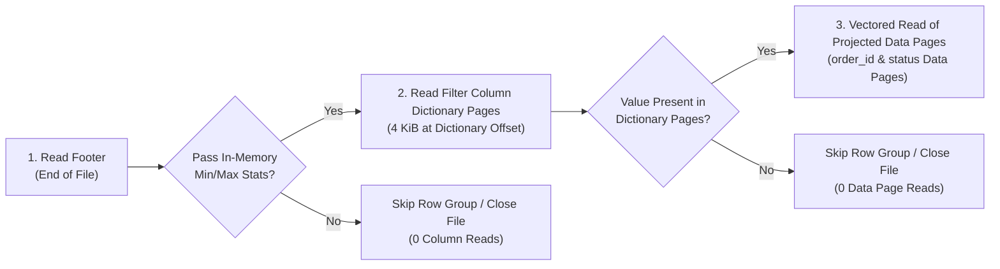
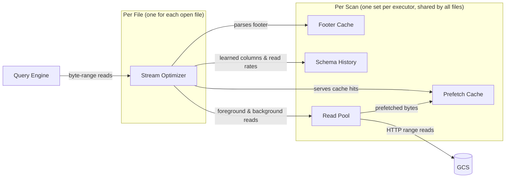
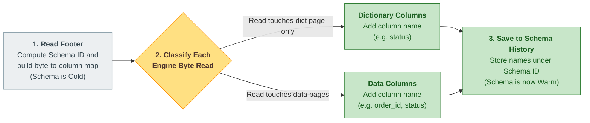
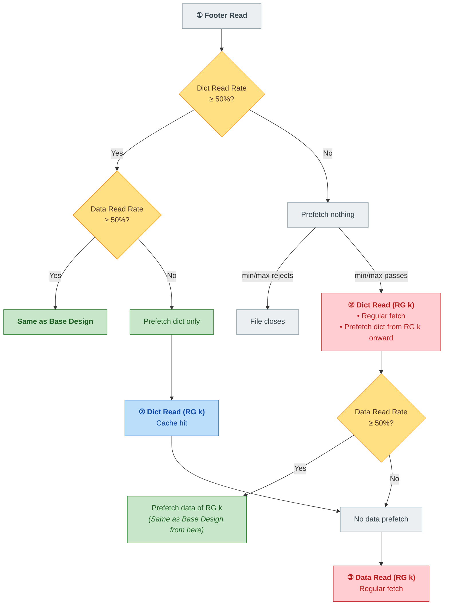
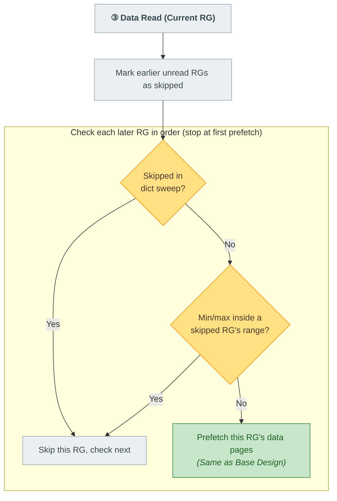
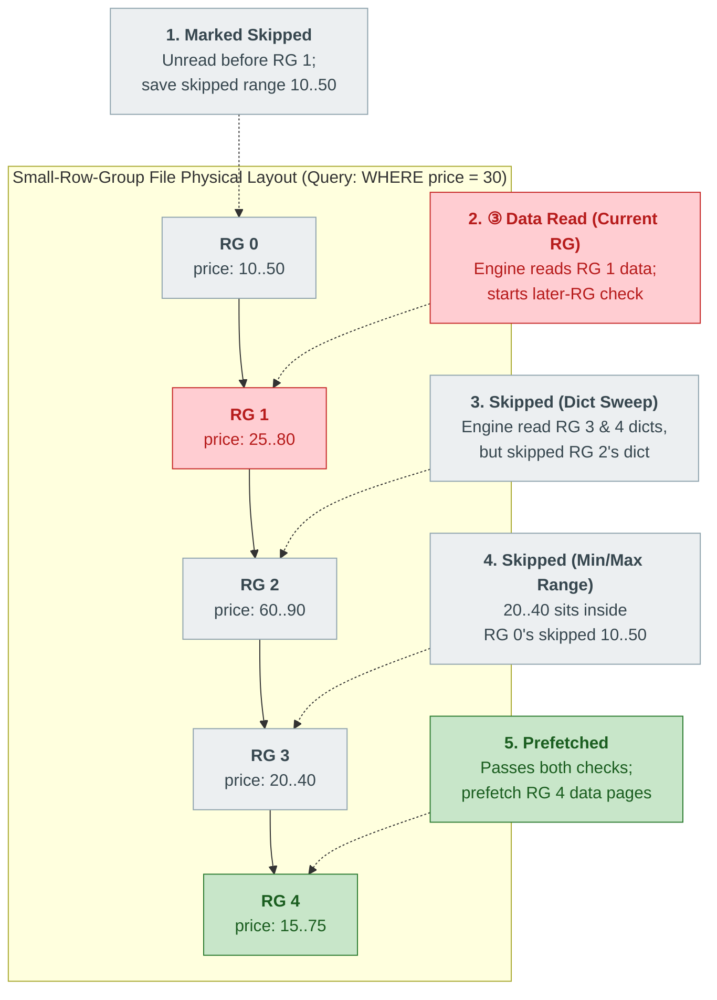
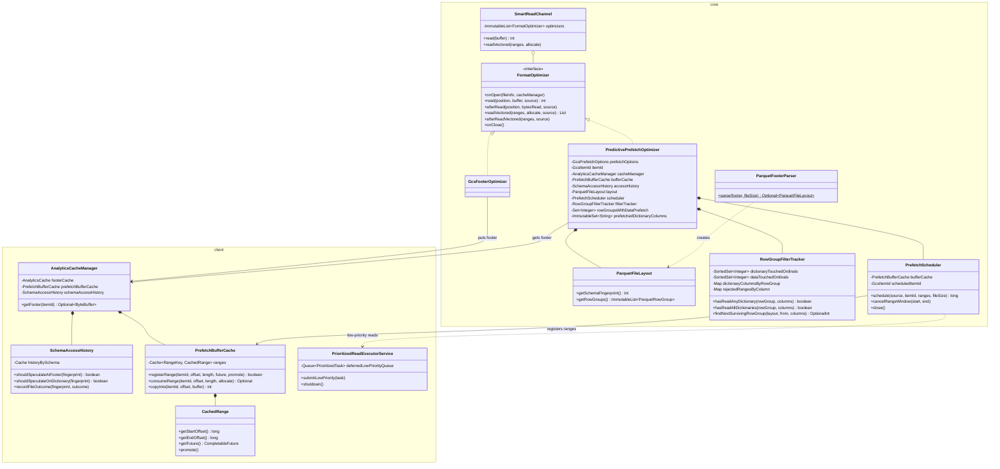
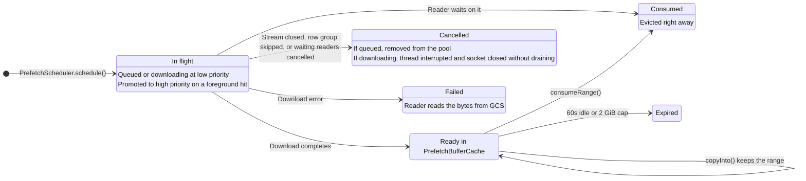

# Predictive Prefetching in GCS Analytics Core

**Self link:** [go/gcs-analytics-core-predictive-prefetch](http://goto.google.com/gcs-analytics-core-predictive-prefetch)  
**Visibility:** Confidential  
**Status:** Draft  
**Authors:** [Prudhvi Beerelly](mailto:pbeerelly@google.com)  
**Contributors:** N/A  
**Team:** Cloud Storage Analytics  
**Tracking Buganizer issue/hotlist:** N/A  
**Last major revision:** 2026-09-24

---

# Context

## Objective

Reduce Google Cloud Storage (GCS) network wait times during Apache Parquet scans in analytical query engines (such as Apache Spark, Apache Iceberg, and Trino) by predicting and prefetching the exact column byte ranges a query needs while the CPU decodes earlier data. Achieve an `XX%` reduction in table scan time without downloading unprojected columns or wasting network bandwidth on files and row groups skipped by query filters.

## Background

Analytical tables on GCS are stored as Apache Parquet files partitioned horizontally into **Row Groups** (typically `128 MiB` each) and vertically into **Column Chunks** (each starting with a small **Dictionary Page** followed by compressed **Data Pages**). At the end of the file, the **File Footer** stores the schema, column byte offsets, and `[min, max]` value statistics for every row group. Diagrams in this doc shorten row group to **RG** and dictionary page to **dict page**.

When executing a filtered query such as `SELECT order_id FROM orders WHERE status = 'PENDING'`, the query engine evaluates a three-stage filter funnel before reading multi-MiB data pages:

Without prefetching, the query engine stalls on GCS network round-trips (`5–25 ms` first-byte latency) between every row group and file. However, traditional sequential read-ahead fails on Parquet workloads for three reasons:
1. **Columnar Sparsity**: Selecting 2 columns (`40 MiB`) out of a `128 MiB` row group leaves `88 MiB` of unprojected columns (`amount`) in between; fixed-window read-ahead downloads those unused bytes.
2. **Non-Sequential Seeks**: The reader seeks backward from the footer at the end of the file to small `4 KiB` dictionary pages before issuing coalesced vectored reads for projected data pages.
3. **High Filter Rejection**: Query engines frequently skip row groups or close files immediately after checking the footer or a `4 KiB` dictionary page; eagerly prefetching multi-MiB data pages wastes network bandwidth and memory.

### How Engines Split Files Across Tasks

A table scan is divided into **task splits**: byte ranges of files, each read by one task. Apache Iceberg aims for `128 MiB` per split by default (`read.split.target-size`) and cuts Parquet files only at row group boundaries. A task reads only the row groups that start inside its split, so the size of a row group compared to a split decides which row groups a task reads. This gives three **file layouts**, used throughout this doc:

| File Layout | Example (`128 MiB` splits) | Who Reads the File |
| :--- | :--- | :--- |
| **Single-Row-Group Files** | A `100 MiB` file with one row group. | One task reads the whole file. Small files are packed together, so one task may read ten `10 MiB` files one after another. |
| **Small-Row-Group Files** | A `512 MiB` file with 32 row groups of `16 MiB`. | Each task reads several row groups in a row (here, 8). |
| **Large-Row-Group Files** | A `512 MiB` file with four `128 MiB` row groups. | Four tasks, each reading one row group, often on different executors. |

## Goals and Non-Goals

### Goals
* **Minimal Read Amplification**: Prefetch only the column byte ranges the active query reads, adding at most `XX%` extra GCS egress over the same scan without prefetching.
* **Query-Agnostic Column Learning**: Learn which columns a query reads directly from its byte-range reads on the first file, and reuse that knowledge for later files with the same schema.
* **Filter-Aware Speculation**: Adapt dynamically to file and row-group filter pass rates so selective scans never download data pages for rejected files or pruned row groups.
* **Foreground Priority Isolation**: Guarantee that background prefetching never starves urgent foreground reads or delays stream and filesystem close operations.

### Non-Goals
* **Cross-Query State Sharing**: Learned column history and cached buffers live only as long as the storage filesystem instance (one per table scan per executor in Iceberg). Sharing state across unrelated queries or across separate scans in a self-join is a non-goal.
* **Non-Parquet Formats**: Layout-aware prefetching targets Apache Parquet; other formats (CSV, JSON, ORC, Avro) use standard read paths.
* **Parquet Modular Encryption with Encrypted Footers**: Standard GCS encryption (GMEK, CMEK, CSEK) and Parquet Modular Encryption with plaintext footers (`PAR1` mode) are fully supported. Only Parquet files with client-side encrypted footers (`PARE` magic bytes) cannot have their column offsets parsed at the storage layer and gracefully fall back to standard reads. The same fallback applies when a footer is larger than the cached file tail.

---

# Design

## High-Level Design

### Components and Scope

Predictive prefetching runs inside the storage input stream, between the query engine and GCS. It has two kinds of parts: a **per-file** part, created when the engine opens a file and dropped when it closes it, and **per-scan** parts, created once on each executor for a table scan and shared by every file that scan opens.

| Component | Kind | Job |
| :--- | :--- | :--- |
| **Stream Optimizer** | Per file | Watches the engine's byte reads, decides what to prefetch next, and cancels unused prefetches when the file closes. |
| **Footer Cache** | Per scan | Holds the tail of each file, filled when the engine first reads the footer. The Stream Optimizer only parses this copy and never fetches a footer itself. |
| **Schema History** | Per scan | Remembers which columns the query reads and how often files are skipped, keyed by the table schema. |
| **Prefetch Cache** | Per scan | Holds prefetched bytes until a foreground read uses them. |
| **Read Pool** | Per scan | Runs all GCS downloads for the scan, both foreground and background. |

**Scope.** The shared parts live as long as the storage filesystem instance that opens the files. Apache Iceberg creates one such instance per table scan on each executor, which is what makes the shared state scan-scoped. Engines that share one filesystem instance across the whole JVM would share history across scans.

**Safety.** Prefetching never changes the bytes the engine receives. Every read is served either from prefetched bytes of the same range or from GCS. If a prefetch fails or is cancelled, the read falls back to GCS. A wrong prediction only costs time or bandwidth.

**When it turns off.** The Stream Optimizer needs the footer from the Footer Cache. If the footer cache is disabled, the footer is larger than the cached tail, or the footer is encrypted, the stream does not prefetch for that file.

---

### 1. Learning Columns: Cold to Warm

The stream never sees the SQL query. It only sees raw byte-range reads. Column byte positions change from file to file, but every file in the scan runs the same query and reads the same columns. So the stream learns column **names** on the first file, then looks up their **positions** in each later file's footer. It uses two things to do this:

* **Schema ID**: a hash of the column names and types listed in the footer. All files of the same table get the same ID.
* **Schema History**: a map that stores two lists for each Schema ID: **Dictionary Columns** (columns whose dictionary pages the engine read without their data pages, to check a filter) and **Data Columns** (columns whose data pages it read). A column can be in both. It is shared by all files opened through the same file system instance (see Scope), so if an engine reuses that instance across scans, it also keeps columns from earlier queries that the current query may not use.

Once the entry holds columns, the schema is **Warm**, and every later file with the same Schema ID becomes a candidate for prefetching.

> **Example** (`SELECT order_id, status FROM orders WHERE status = 'PENDING'`)
> 1. File 1's footer is read. The stream builds its byte-to-column map. Nothing is known yet (**Cold**).
> 2. The engine reads the dictionary of `status`. Dictionary Columns = `[status]`.
> 3. The engine reads the data pages of `order_id` and `status`, and skips `amount`. Data Columns = `[order_id, status]`. The schema is now **Warm**.

---

### 2. Base Design: What Each File Layout Prefetches

What the stream can safely prefetch depends on the file layout (see Background) and on whether the schema is Cold or Warm. The diagram uses two terms:

* **Dictionary trigger**: the dictionary page read in row group `k` that starts the prefetch of `k`'s data pages. By default it is the read of the last Dictionary Column in `k`.
* **Next RG**: the row group after the one the engine is reading. Prefetching it lets its download overlap with decoding the current one.

```mermaid
flowchart LR
    subgraph Cold["❄️ COLD: first file, still learning columns"]
        direction TB
        subgraph CS["Single-Row-Group Files"]
            direction TB
            cs1["<b>① Footer Read</b><br/>Nothing: no columns<br/>learned yet"] --> cs2["<b>② Dictionary Read</b><br/>Add column to<br/>Dictionary Columns"] --> cs3["<b>③ Data Page Read</b><br/>• Add to Data Columns<br/>• Regular fetch of the RG"]
        end
        subgraph CM["Small-Row-Group Files"]
            direction TB
            cm1["<b>① Footer Read</b><br/>Nothing: no columns<br/>learned yet"] --> cm2["<b>② Dictionary Read</b><br/>• Add to Dictionary Columns<br/>• Prefetch dict pages of later RGs<br/>• No data prefetch: no<br/>Data Columns known yet"] --> cm3["<b>③ Data Page Read</b><br/>• Add to Data Columns<br/>• Regular fetch of RG k<br/>• Prefetch next RG,<br/>using columns learned so far"]
        end
        subgraph CL["Large-Row-Group Files"]
            direction TB
            cl1["<b>① Footer Read</b><br/>Nothing: no columns<br/>learned yet"] --> cl2["<b>② Dictionary Read</b><br/>• Add to Dictionary Columns<br/>• Prefetch dict pages of later RGs<br/>• No data prefetch: no<br/>Data Columns known yet"] --> cl3["<b>③ Data Page Read</b><br/>• Add to Data Columns<br/>• Regular fetch of RG k<br/>• No next-RG prefetch"]
        end
    end

    subgraph Warm["🔥 WARM: later files, columns known"]
        direction TB
        subgraph WS["Single-Row-Group Files"]
            direction TB
            ws1["<b>① Footer Read</b><br/>Prefetch data pages, plus<br/>dict pages if Dictionary<br/>Columns is non-empty"] --> ws2["<b>② Dictionary Read</b><br/>Cache hit"] --> ws3["<b>③ Data Page Read</b><br/>Cache hit"]
        end
        subgraph WM["Small-Row-Group Files"]
            direction TB
            wm0{"<b>① Footer Read</b><br/>Dictionary Columns<br/>non-empty?"}
            wm0 -- "Yes" --> wm1a["Prefetch dict pages<br/>of all RGs"]
            wm0 -- "No: no filter" --> wm1b["Prefetch data pages<br/>of first RG"]
            wm1a --> wm2["<b>② Dictionary Read</b><br/>• Cache hit<br/>• When the dictionary trigger<br/>fires for RG k (first or last<br/>Dict Column read): prefetch<br/>Data Columns of RG k"]
            wm2 --> wm3["<b>③ Data Page Read</b><br/>• Cache hit<br/>• Prefetch next RG:<br/>overlaps decoding RG k"]
            wm1b --> wm2b["<b>② Dictionary Read</b><br/>None: no filter"]
            wm2b --> wm3b["<b>③ Data Page Read</b><br/>• Cache hit<br/>• Prefetch next RG:<br/>overlaps decoding RG k"]
        end
        subgraph WL["Large-Row-Group Files"]
            direction TB
            wl0{"<b>① Footer Read</b><br/>Dictionary Columns<br/>non-empty?"}
            wl0 -- "Yes" --> wl1a["Prefetch dict pages<br/>of all RGs"]
            wl0 -- "No: no filter" --> wl1b["Nothing: owned RG<br/>unknown"]
            wl1a --> wl2["<b>② Dictionary Read</b><br/>• Cache hit<br/>• When the dictionary trigger<br/>fires for RG k (first or last<br/>Dict Column read): prefetch<br/>Data Columns of RG k"]
            wl2 --> wl3["<b>③ Data Page Read</b><br/>• Cache hit<br/>• No next-RG prefetch"]
            wl1b --> wl2b["<b>② Dictionary Read</b><br/>None: no filter"]
            wl2b --> wl4["<b>③ Data Page Read</b><br/>• Regular fetch of RG k<br/>• No next-RG prefetch"]
        end
    end

    Cold ==>|"Schema ID now has<br/>columns in Schema History"| Warm

    subgraph Legend["Legend"]
        direction TB
        lg1["Nothing"]
        lg2["Prefetch"]
        lg3["Cache hit"]
        lg4["Regular fetch (miss)"]
        lg5["Green border:<br/>also prefetches ahead"]
        lg6{"Decision"}
    end

    classDef none fill:#eceff1,stroke:#90a4ae,color:#37474f
    classDef pref fill:#c8e6c9,stroke:#2e7d32,color:#1b5e20
    classDef hit fill:#bbdefb,stroke:#1565c0,color:#0d47a1
    classDef fetch fill:#ffcdd2,stroke:#c62828,color:#b71c1c
    classDef hitpref fill:#bbdefb,stroke:#2e7d32,stroke-width:4px,color:#0d47a1
    classDef fetchpref fill:#ffcdd2,stroke:#2e7d32,stroke-width:4px,color:#b71c1c
    classDef gate fill:#ffe082,stroke:#ff8f00,color:#4e342e
    class cs1,cs2,cm1,cl1,wl1b,wm2b,wl2b,lg1 none
    class cm2,cl2,ws1,wm1a,wm1b,wl1a,lg2 pref
    class ws2,ws3,wl3,lg3 hit
    class cs3,cl3,wl4,lg4 fetch
    class wm2,wm3,wm3b,wl2,lg5 hitpref
    class cm3 fetchpref
    class wm0,wl0,lg6 gate
```

#### Why the Three Layouts Differ

* **Single-row-group files**: The task owns the whole file, so on a Warm schema the footer read alone is enough to prefetch everything the query will read.
* **Small-row-group files**: The task reads several row groups in a row. After it reads row group `k`, the stream prefetches the next RG so that download overlaps with decoding `k`. The dictionary trigger covers the first row group a task reads, which has no earlier row group to prefetch it.
* **Large-row-group files**: Each task owns one row group, but every task reads the footer first, so the footer read does not show which row group is this task's. Example: a file has 4 row groups, and Task 2 owns only row group 2. Prefetching data pages on the footer read could download row group 0, which is Task 0's. So the stream waits for the dictionary trigger, which shows the task is checking row group `k`. It never prefetches the next RG: readers never read data outside their split, and Task 2 closes after row group 2, so prefetching row group 3 would be wasted.

#### Choosing the Dictionary Trigger

With a filter like `WHERE a = 1 AND b = 2`, the engine checks `a`'s dictionary, then `b`'s, and skips the row group at the first check that fails. The trigger can fire on either end of that sequence:

| Trigger | Fires When | Gain | Cost |
| :--- | :--- | :--- | :--- |
| **Last Dictionary Column read** (default) | The dictionary pages of every Dictionary Column in row group `k` are read. | Reaching the last dictionary means every earlier check passed, so only one check is still open and the data pages will very likely be read. | The download starts later, so it overlaps less with the dictionary checks. |
| **First Dictionary Column read** | The dictionary pages of any Dictionary Column in row group `k` are read. | The download starts as early as possible and overlaps with every check. | Downloads a row group of data pages that a later check may reject. |

The default is the last read because data pages are the largest downloads, and a wrong guess costs a full row group. The first read is the better choice when filters rarely reject row groups, or when Schema History is shared across scans with different filters (see Known Gaps in the LLD).

The trigger fires at most once per row group, and only for the front row group: the lowest one whose prefetched data pages are still waiting to be read. During an upfront dictionary sweep this keeps one row group of data pages in memory instead of one per swept row group. Once data reads start, the next-RG prefetch covers the rest. A row group counts as prefetched only when its data pages were actually queued, so a trigger that queued nothing fires again on the next dictionary read. A row group whose data pages were already prefetched as the next RG is not downloaded again.

Dictionary reads never cancel a prefetch, because moving to the next row group's dictionary is only a check, not a skip. Only a data read in a later row group proves the earlier ones were skipped, and it cancels their prefetches.

#### Accepted Trade-offs

* **No data prefetch on large-row-group files without a filter.** With no Dictionary Columns there is no dictionary read to show which row group the task owns, so each task's row group is a regular fetch. Guessing would download other tasks' row groups on every footer read.
* **Other tasks' dictionary pages on large-row-group files.** The footer read prefetches the dictionary pages of all row groups, because the stream does not yet know which one the task owns. Dictionary pages are small, so this costs little compared to the data pages it carefully avoids.
* **One regular fetch after a row group rejected by its dictionary.** The front row group keeps its prefetch until a later data read proves it was skipped, so the next row group that passes is not prefetched during the sweep. Its first data read is a regular fetch, and the next-RG prefetch resumes from there.

---

### 3. Guardrail 1: Selective Queries and Read-Rate Gates

#### What Breaks

The Background section shows the two points where the engine drops a file: after the min/max check on the footer, and after checking the dictionary pages. On highly selective queries, such as `WHERE order_date = '2026-09-23'` on date-partitioned data or `WHERE customer_id = 'CUST_999'` on wide min/max ranges, most files stop at one of these points. The Base Design then wastes work in two ways:

1. Files skipped after the footer close a few microseconds after the footer read, so every prefetch started on the footer read is a wasted HTTP request.
2. Files skipped after checking the dictionary pages never read data pages, so prefetching their data pages wastes the largest downloads.

#### How the Stream Measures It

For each file, Schema History records how far the engine got, separately for each Schema ID:

| File Outcome | What the Engine Read |
| :--- | :--- |
| **Skipped after Footer** | Only the footer. |
| **Skipped after Dictionary** | At least one dictionary page, but no data pages. |
| **Data Read** | At least one data page. |

From these, it computes two rates:

$$\text{Dictionary Read Rate} = \frac{\text{Skipped after Dictionary} + \text{Data Read}}{\text{last 8 files}}$$

$$\text{Data Read Rate} = \frac{\text{Data Read}}{\text{last 8 files that read a dictionary or data page}}$$

Each gate stays open while its rate is at least 50%, or while fewer than 2 files have been recorded. Both numbers are fixed constants, not tuned per workload. A window of 8 files lets a gate react within a few files while one unusual file cannot flip it. The 50% line means prefetching stops once more files are skipped than read.

#### How the Gates Change the Base Design

Each gate turns off one kind of prefetch. The two gates work separately, and while a gate is open, that part is Same as Base Design.

| Gate | What It Guards | When Closed (rate < 50%) |
| :--- | :--- | :--- |
| **Dictionary Read Rate** | Prefetch on the footer read | The footer read prefetches nothing. The first dictionary read in row group `k` then prefetches the dictionary pages from row group `k` onward, since that read proves the file passed min/max. |
| **Data Read Rate** | Data page prefetch on the footer and dictionary reads | The dictionary trigger is off, and the footer read skips data pages. Data pages of row group `k` wait until the engine reads them. |

If both rates are low, both rules apply. Neither gate changes the next-RG prefetch that follows a data page read.

The rates only look at the last 8 files, so they recover by themselves. Example: if a scan moves from non-matching partitions into matching ones, 4 Data Read files in a row bring the Dictionary Read Rate back to 50% and turn footer-read prefetching back on.

The diagram shows a Warm schema whose query has a filter, since that is when the gates matter.

---

### 4. Guardrail 2: Skipping Rejected Row Groups Inside a File

This guardrail refines the Base Design's **next RG** into the **next surviving RG**. It only matters for small-row-group files: single-row-group files have no next row group, and large-row-group files never prefetch one.

#### What Breaks

After each row group a task reads from a small-row-group file, the Base Design prefetches the next RG. On selective queries, especially when the data is sorted or clustered by the column in the `WHERE` condition, the engine skips many of those row groups because their min/max or dictionary pages fail the filter. Prefetching a skipped row group wastes a full row group of downloads.

#### How the Stream Picks the Next Row Group

After a data page read in the current row group, the stream marks any earlier unread row groups as skipped, then checks each later row group in order and prefetches the first one that no signal rules out:

| Signal | What the Engine Does | How the Stream Uses It |
| :--- | :--- | :--- |
| **Skipped in the dictionary sweep** | Some readers (such as Iceberg) check min/max for all row groups when the file opens, then read the dictionary pages of every row group that passed, before reading any data pages. | If the stream has seen dictionary page reads for row groups 0, 2, and 3 but not 1, then row group 1 failed the filter. The stream skips it and prefetches row group 2. |
| **Min/max inside a rejected range** | The engine skipped an earlier row group, for example one where `price` ranges from 10 to 50. | If a later row group's `price` range (for example, 20 to 40) sits entirely inside the skipped range, the stream predicts it will be skipped too. |

Both signals are predictions. The min/max signal is wrong in two cases:

* The earlier row group was skipped by its **dictionary pages**, not its min/max. Example: `price = 30` is inside `[10, 50]` but missing from that row group's dictionary pages, while the later `[20, 40]` row group does contain 30.
* The filter uses **several columns** (`a = 1 AND b = 2`). The earlier row group may have been skipped because of `b`, which says nothing about `a`.

> **Example** (`SELECT order_id FROM orders WHERE price = 30` on a 5-row-group file)
> 1. **Upfront dict sweep:** `30` falls inside the min/max of **RG 0**, **RG 1**, **RG 3**, and **RG 4**, so the engine reads their dictionary pages and skips **RG 2** (`price: 60..90`).
> 2. **RG 0** (`price: 10..50`) does not have `30` in its dictionary, so the engine skips its data pages and reads data in **RG 1** (`price: 25..80`). On the **RG 1** data read, the stream marks earlier unread **RG 0** as skipped and saves its `[10, 50]` range.
> 3. **Check RG 2 (`price: 60..90`):** The engine already read later dictionaries (**RG 3**, **RG 4**) without reading **RG 2**'s dictionary, so the stream skips **RG 2** (**Signal 1: Dict Sweep**).
> 4. **Check RG 3 (`price: 20..40`):** Its dictionary was read, but `[20, 40]` sits inside **RG 0**'s skipped `[10, 50]` range, so the stream skips **RG 3** (**Signal 2: Min/Max Range**).
> 5. **Check RG 4 (`price: 15..75`):** Its dictionary was read and `[15, 75]` is not inside `[10, 50]`, so the stream prefetches **RG 4**'s data pages while the engine decodes **RG 1**.

---

### 5. Runtime Protections

The guardrails above decide *what* to prefetch. These protections control *how* prefetches run, so background work never slows the query. They matter most when many tasks prefetch at once on the same executor (large multi-row-group files) and during shuffle-heavy queries, where network bandwidth and memory are already tight.

| Protection | What It Does | Problem It Prevents |
| :--- | :--- | :--- |
| **Wait for the foreground read** | The prefetch of the next row group starts only after the current row group's foreground download finishes. Applies to vectored reads. | Background downloads competing with the current row group's urgent download. |
| **Reserved foreground threads** | Background downloads run at low priority and may use only part of the Read Pool. The rest is kept for foreground reads. | Many tasks' prefetches filling the pool and blocking foreground reads. |
| **In-place promotion** | If a foreground read needs bytes that are still queued or downloading in the background, that download is raised to foreground priority and the reader waits for it. | Downloading the same bytes twice. |
| **No duplicate dictionary prefetch** | A dictionary read prefetches later dictionary pages only if the footer or an earlier read has not already cached or started them. Ranges that were dropped or failed are tried again. | Queuing the same dictionary pages again on every dictionary read. |
| **Bounded chunks and instant eviction** | Neighboring columns are merged into chunks of a capped size. Bytes served to batch (vectored) reads are dropped from the Prefetch Cache as soon as the engine reads them. | Large heap spikes and garbage-collection pauses. |
| **Bounded cache and in-flight limit** | The Prefetch Cache has a total size cap and drops entries that sit unused for too long. Each stream also caps how many prefetches it can have in flight. | Unused prefetches piling up in memory, or one stream flooding the Read Pool. |
| **Abort instead of drain** | Background downloads read in small slices. When a file closes or a row group is skipped, the download thread is interrupted and the connection is closed without reading the rest. | Draining unread megabytes over the network while shuffle stages need the bandwidth. |

---

## Low-Level Design

### 1. Module View

Parquet parsing and prefetch decisions live in `core`, and each open stream gets its own set of these objects. The caches, schema history, and prioritized read pool live in `client`, and all streams of one filesystem instance share them. `PredictivePrefetchOptimizer` never reads the footer from GCS; it uses the footer that `GcsFooterOptimizer` cached. Filled diamonds mean "owns"; the four labeled arrows are the only calls between classes that do not own each other.

### 2. From HLD Events to Code Hooks

`SmartReadChannel` calls each `FormatOptimizer` hook in order. `PredictivePrefetchOptimizer` maps the HLD events onto them as follows:

| Hook | HLD Event | What `PredictivePrefetchOptimizer` Does |
| :--- | :--- | :--- |
| `onOpen` | Stream opens | Binds the shared cache and history, creates a fresh `PrefetchScheduler` and `RowGroupFilterTracker`. |
| `read` / `afterRead` | Footer, dictionary, or data read (single buffer) | Serves from `PrefetchBufferCache.copyInto`, loads the layout on first use, then calls `observeAccess`: footer reads go to `prefetchFirstRowGroupOnce`, dictionary page reads go to `onDictionaryPageRead` (dictionary de-duplication and the dictionary trigger), data page reads go to `speculateRowGroups`. |
| `readVectored` | Data read (vectored) | Serves each range from `PrefetchBufferCache.consumeRange`, then `recordVectoredAccess` records columns and picks the next surviving row group. |
| `afterReadVectored` | After the foreground vectored read is submitted | Footer case goes to `prefetchFirstRowGroupOnce`. Otherwise, unless the file is a large-row-group file, waits on the foreground range futures, then calls `speculateRowGroup` for the next surviving row group. |
| `onClose` | Stream closes | Records the file outcome in `SchemaAccessHistory` (if not already recorded) and cancels all unconsumed prefetches. |

When the engine reads data in row group `j`, `onDataPageRead` calls `PrefetchScheduler.cancelRangeWindow` on the row groups between the previous data read and `j`, because the engine skipped them. Dictionary reads never cancel prefetches.

### 3. Component Contracts

| Class | Module, Scope | Responsibility | Bounds |
| :--- | :--- | :--- | :--- |
| [`ParquetFooterParser`](file:///usr/local/google/home/pbeerelly/Downloads/gcs-analytics-core/core/src/main/java/com/google/cloud/gcs/analyticscore/core/prefetch/ParquetFooterParser.java), [`ParquetFileLayout`](file:///usr/local/google/home/pbeerelly/Downloads/gcs-analytics-core/core/src/main/java/com/google/cloud/gcs/analyticscore/core/prefetch/ParquetFileLayout.java) | `core`, per stream | Parses the cached footer into an immutable layout: schema fingerprint, row groups, column byte ranges, and min/max statistics. | No network I/O. Returns empty when the footer is missing, longer than the cached tail, or encrypted (`PARE`). |
| [`PredictivePrefetchOptimizer`](file:///usr/local/google/home/pbeerelly/Downloads/gcs-analytics-core/core/src/main/java/com/google/cloud/gcs/analyticscore/core/prefetch/PredictivePrefetchOptimizer.java) | `core`, per stream | Serves cached ranges, classifies reads, and decides what to prefetch. | Large-row-group file when more than 1 row group and row group 0 is at least `64 MiB`; such files never pick a next row group (`shouldSpeculateNextRowGroup`). The dictionary trigger (`FIRST_DICT_READ` or `LAST_DICT_READ`) fires once per row group (`rowGroupsWithDataPrefetch`), only when no earlier row group's prefetch is still waiting for its data read (`hasPendingDataPrefetchBefore`), prefetches data ranges only, and marks the row group only when every data range is registered in the cache. Later dictionary pages are prefetched again only when `prefetchedDictionaryColumns` does not cover the known set; that set is recorded only when every range is registered in the cache. Dictionary ranges `[dictOffset, dataOffset)` are kept apart from data ranges `[dataOffset, endOffset)`. Merged chunks are capped at `block.size-bytes`. |
| [`RowGroupFilterTracker`](file:///usr/local/google/home/pbeerelly/Downloads/gcs-analytics-core/core/src/main/java/com/google/cloud/gcs/analyticscore/core/prefetch/RowGroupFilterTracker.java) | `core`, per stream | Tracks which row groups had dictionary page and data page reads, and the min/max ranges of skipped row groups. Answers the trigger checks `hasReadAnyDictionary` and `hasReadAllDictionaries`. | Per-stream state only. |
| [`PrefetchScheduler`](file:///usr/local/google/home/pbeerelly/Downloads/gcs-analytics-core/core/src/main/java/com/google/cloud/gcs/analyticscore/core/prefetch/PrefetchScheduler.java) | `core`, per stream | Registers ranges in the cache, submits them as low-priority vectored reads, and cancels them by window or on close. | At most `32` in-flight ranges per stream. Skips ranges already in the cache. |
| [`SchemaAccessHistory`](file:///usr/local/google/home/pbeerelly/Downloads/gcs-analytics-core/client/src/main/java/com/google/cloud/gcs/analyticscore/client/SchemaAccessHistory.java) | `client`, per filesystem instance | Maps schema fingerprint to learned columns and the two outcome windows. | `1,024` schemas, `256` columns per schema. Two 8-entry windows: all files, and files that passed the footer. Gate open when fewer than 2 entries or rate at least `0.50`. |
| [`PrefetchBufferCache`](file:///usr/local/google/home/pbeerelly/Downloads/gcs-analytics-core/client/src/main/java/com/google/cloud/gcs/analyticscore/client/PrefetchBufferCache.java), [`CachedRange`](file:///usr/local/google/home/pbeerelly/Downloads/gcs-analytics-core/client/src/main/java/com/google/cloud/gcs/analyticscore/client/CachedRange.java) | `client`, per filesystem instance | Byte-weighted Caffeine cache keyed by `(GcsItemId, startOffset)`, with a per-file offset index to find and stitch covering ranges. | `2 GiB` cap, `60s` idle expiry. Ranges consumed by `consumeRange` are evicted right away; `copyInto` does not evict (see Known Gaps). Exact matches return a zero-copy `duplicate()`. |
| [`PrioritizedReadExecutorService`](file:///usr/local/google/home/pbeerelly/Downloads/gcs-analytics-core/client/src/main/java/com/google/cloud/gcs/analyticscore/client/PrioritizedReadExecutorService.java), [`GcsReadChannel`](file:///usr/local/google/home/pbeerelly/Downloads/gcs-analytics-core/client/src/main/java/com/google/cloud/gcs/analyticscore/client/GcsReadChannel.java) | `client`, per filesystem instance | 16-thread priority pool and HTTP channel with promotion, exact ranges (`effectiveMaxMergeGap = 0`), and interruptible reads. | Low-priority tasks use at most `10` of `16` threads. Reads in `256 KiB` slices. Cancel interrupts the thread before closing the channel. `shutdown()` waits at most `10 ms`. |

### 4. Threading Model

* `PredictivePrefetchOptimizer`, `RowGroupFilterTracker`, and `PrefetchScheduler` belong to one stream and are called from the reader's thread.
* One exception: `afterReadVectored` schedules the next row group from a future callback that runs on a pool thread. `speculateRowGroup` is `synchronized` and checks the `volatile closed` flag, so a callback that fires after `onClose` does nothing. `rowGroupsWithDataPrefetch` is a concurrent set because that callback also adds to it.
* `SchemaAccessHistory`, `PrefetchBufferCache`, and `PrioritizedReadExecutorService` are shared across streams and are thread-safe.

### 5. Prefetched Range Lifecycle

### 6. Known Gaps

Deliberate trade-offs are listed in the HLD (Accepted Trade-offs). These are behaviors that could be improved later:

| Gap | Where | Effect |
| :--- | :--- | :--- |
| Tasks that start partway through a small-row-group file prefetch the first row group. | `prefetchFirstRowGroupOnce` calls `speculateRowGroup(source, 0)` for non-large files when there are no dictionary columns. | Downloads another task's first row group on every footer read of a no-filter scan. Example: Task 2 starts at row group 8 but prefetches row group 0, which belongs to Task 0. |
| Row groups owned by other tasks are recorded as skipped. | `RowGroupFilterTracker.markSkippedRowGroupsBefore` walks every ordinal below the current one. | A task whose split starts at row group 5 records row groups 0 to 4 as skipped, which can wrongly rule out later row groups in its own split. |
| The wait for the foreground read covers only the vectored path. | `observeAccess` calls `speculateRowGroups` right away on single-buffer reads. | Non-vectored readers can start the next row group while the current one is still downloading. |
| Stale Dictionary Columns keep the last-read trigger from firing. | `hasReadAllDictionaries` needs every known dictionary column, and `SchemaAccessHistory` never removes columns. | When the filesystem instance is reused across scans, an earlier filter on `c` leaves Dictionary Columns = `[a, b, c]`. A new query with `WHERE a = 1 AND b = 2` never reads `c`'s dictionary, so no data page prefetch fires for the rest of the instance's life. `FIRST_DICT_READ` avoids this. |
| Single-buffer cache hits do not evict. | `PrefetchBufferCache.copyInto` never removes ranges; only `consumeRange` does. | Bytes served to single-buffer reads stay until the stream closes, 60s idle, or the 2 GiB cap. For Iceberg these are mostly small dictionary pages, because its data reads are vectored. Evicting on read is not safe as is: the column chunk read re-reads the dictionary page first, and without that entry the whole chunk, including prefetched data pages, is fetched from GCS. |

---

## Alternatives Considered

### Overall Approach

| Dimension | Proposed: Layout- & Filter-Aware Predictive Prefetching (Scan-Scoped) | Alternative 1: Fixed-Block Sequential Read-Ahead (8 MiB Windows) | Alternative 2: Unconditional Eager Row-Group 0 Prefetch at Footer Read | Alternative 3: Global JVM Singleton for Schema History & Cache |
| :--- | :--- | :--- | :--- | :--- |
| **Read Amplification on Wide Tables** | ➕ **Zero unprojected bytes** (`effectiveMaxMergeGap = 0`; fetches exact projected column ranges). | ➖ **High** (downloads unprojected columns between projected columns). | ➕ **Low on surviving files**, **high on skipped files**. | ～ Same within a single scan, **polluted on self-joins**. |
| **Selective Filter Queries (High File Skipping)** | ➕ **Zero wasted requests** (8-file sliding window pauses footer-read prefetch when `Dictionary Read Rate < 50%`). | ➖ **High waste** (prefetches ahead of first read before stream closes). | ➖ **Severe waste** (launches multi-MiB HTTP requests for every file before `~3 µs` min/max stats skip the file). | ➖ **Cross-Scan Collision** (a self-join scanning the same table twice with different columns or filters overwrites the shared `Schema ID` state). |
| **Decision** | **SELECTED** | **REJECTED** (Violates zero read-amplification goal). | **REJECTED** (Wastes bandwidth and stalls shuffle stages on selective queries). | **REJECTED** (Collides when concurrent scans or self-joins read different columns/filters of the same table). |

### Row Group Ownership

| Alternative | Why Rejected |
| :--- | :--- |
| **Prefetch the next row group on large-row-group files once a task has read two row groups.** | Readers never read data outside their split, and a split on these files almost always holds one row group, so the unlock rarely helps. When it does fire at a split's end, it downloads another task's row group. |
| **Fire the dictionary trigger once per stream instead of once per row group.** | The first row group a task reads on a small-row-group file was always a cache miss, and a row group rejected by its dictionary used up the only trigger, so later row groups got nothing. |
| **Cancel a row group's prefetch as soon as the engine moves to a later row group.** | During an upfront dictionary sweep the move is only a dictionary check. Each swept row group's data prefetch was cancelled before its data read, so the first data read always missed and every aborted download was wasted. |
| **Prefetch the data pages of every row group in the dictionary sweep.** | All candidate row groups would download before the engine reads any data, holding one row group of data pages per swept row group in memory for each stream. Across many tasks this can exceed the shared cache and push out ranges that are about to be read. |

---

# Quality Attributes & Operations

## Latency and Throughput Expectations

| Workload Pattern | Expected Impact |
| :--- | :--- |
| **Single-Row-Group Files (`16–128 MiB`)** | **`XX%` reduction in aggregate table scan time** by overlapping the row group's column downloads with footer parsing and reader initialization. |
| **Small-Row-Group Files** | **`XX%` reduction in aggregate table scan time** by overlapping the next row group's download with decoding the current one. |
| **Large-Row-Group Files (`512 MiB`, `128 MiB` Row Groups)** | **`XX%` reduction in aggregate table scan time** on filtered scans by overlapping each task's data page download with its dictionary checks, without downloading other tasks' data pages. |
| **Highly Selective Scans (90%+ File/Row-Group Pruning)** | **Zero scan regression and `XX%` reduction in shuffle wait overhead** by gating footer-read and dictionary-page-read speculation via the 8-file sliding window and aborting cancelled HTTP sockets with zero unread byte draining. |

## Configuration, Telemetry, and Rollback

### Configuration Properties ([`GcsPrefetchOptions`](file:///usr/local/google/home/pbeerelly/Downloads/gcs-analytics-core/client/src/main/java/com/google/cloud/gcs/analyticscore/client/GcsPrefetchOptions.java))

| Property Key | Default | Description |
| :--- | :---: | :--- |
| `analytics-core.prefetch.mode` | `DISABLED` | Set to `PREDICTIVE_ROW_GROUP` (or `predictive-row-group`) to enable predictive prefetching. |
| `analytics-core.prefetch.dictionary-trigger` | `LAST_DICT_READ` | Which dictionary page read starts the prefetch of a row group's data pages: `FIRST_DICT_READ` (any known Dictionary Column read in the row group) or `LAST_DICT_READ` (all of them read). Case-insensitive; hyphens accepted. |
| `analytics-core.footer.cache.enabled` | `false` | Must be `true` when `PREDICTIVE_ROW_GROUP` is enabled so `GcsFooterOptimizer` populates `AnalyticsCacheManager.getFooter(itemId)`. |
| `analytics-core.prefetch.buffer.cache.max-size-bytes` | `2147483648` (`2 GiB`) | Maximum total byte capacity of `PrefetchBufferCache` per `AnalyticsCacheManager`. |
| `analytics-core.prefetch.buffer.cache.ttl-seconds` | `60` | Idle expiration time (`expireAfterAccess`, in seconds) for unconsumed ranges in `PrefetchBufferCache`. |
| `analytics-core.prefetch.block.size-bytes` | `8388608` (`8 MiB`) | Maximum size of one merged prefetch range; larger spans are split into chunks of this size. |
| `analytics-core.prefetch.history.max-columns` | `256` | Maximum number of dictionary and data columns tracked per `schemaFingerprint` in `SchemaAccessHistory`. |

### Telemetry Metrics ([`GcsAnalyticsCoreTelemetryConstants.Metric`](file:///usr/local/google/home/pbeerelly/Downloads/gcs-analytics-core/common/src/main/java/com/google/cloud/gcs/analyticscore/common/GcsAnalyticsCoreTelemetryConstants.java))

| Metric Constant | Metric Name | Type | Description |
| :--- | :--- | :---: | :--- |
| `PREFETCH_CACHE_HIT` | `gcs.analytics-core.client.prefetch.cache.hits` | `COUNTER` | Foreground `read` or `readVectored` calls served from `PrefetchBufferCache`. |
| `PREFETCH_CACHE_MISS` | `gcs.analytics-core.client.prefetch.cache.misses` | `COUNTER` | Foreground `read` calls that missed `PrefetchBufferCache`. |
| `PREFETCH_BYTES_LOADED` | `gcs.analytics-core.client.prefetch.bytes.loaded` | `COUNTER` | Total speculative bytes downloaded into `PrefetchBufferCache`. |
| `PREFETCH_BYTES_CONSUMED` | `gcs.analytics-core.client.prefetch.bytes.consumed` | `COUNTER` | Total prefetched bytes consumed by foreground `read` or `readVectored` calls. |

### Rollback Strategy
Predictive prefetching is **disabled by default** (`analytics-core.prefetch.mode=DISABLED`). When disabled, `PredictivePrefetchOptimizer.isApplicable` returns `false`, bypassing all prefetch code paths with zero runtime overhead. Any deployment can roll back immediately via configuration by setting `analytics-core.prefetch.mode=DISABLED` without redeploying binaries.

---

# Document history

| Date | Author | Change |
| :--- | :--- | :--- |
| 2026-09-23 | [Prudhvi Beerelly](mailto:pbeerelly@google.com) | Restructured HLD into a 3-stage conceptual pipeline with tables and single-sentence edge cases; reorganized LLD around a module-grouped class diagram, a component contracts/bounds table, and a range lifecycle state machine (`stateDiagram-v2`). |
| 2026-09-24 | [Prudhvi Beerelly](mailto:pbeerelly@google.com) | Reorganized HLD around a component overview and the real file cases (small vs. split-sized row groups); fixed statements that did not match the code; added HLD-to-hook mapping, threading model, and known gaps to the LLD. |
| 2026-09-24 | [Prudhvi Beerelly](mailto:pbeerelly@google.com) | Replaced the Cold/Warm tables with one per-layout flowchart; documented the per-row-group dictionary trigger and its first/last setting, no next-row-group prefetch on large-row-group files, and dictionary prefetch de-duplication; simplified the read-rate gates; split accepted trade-offs (HLD) from known gaps (LLD); added row-group-ownership alternatives. |
| 2026-09-25 | [Prudhvi Beerelly](mailto:pbeerelly@google.com) | Dictionary trigger fires only for the front row group and cancels only on a data read in a later row group; removed the next-row-group dictionary peek gap; documented that single-buffer cache hits do not evict. |
